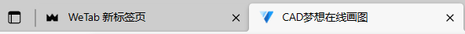
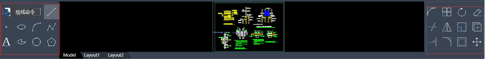

# MxCad项目二次开发插件集成

该项目页面效果图:

前端项目二次开发插件集成:

第一步: 下载MxDraw云图开发包https://www.mxdraw.com/download.html

第二步: 解压打开目录找到MxDrawCloudServer\SRC\TsWeb\public\mxcad 目录所在位置， 这里就是该项目的打包后的项目位置

第三步: 修改配置mxUiConfig.json文件和mxServerConfig.json文件

可根据自己的需求去修改一些固定配置。

第四步: 再到plugins目录下创建一个testPlugin.js文件, 

然后我们可用在对应的config.json文件中配置plugins属性, 新增一个testPlugin字符串。

第五步: 在testPlugin.js 写任意的js代码, 项目都会运行, 

这个时候你可用访问window属性中的Mx、mxcad、Vue 它们分别是mxdraw、mxcad、vue的默认导出。

具体如何使用mxdraw和mxcad库参考文档:https://mxcadx.gitee.io/mxdraw_docs/start/abstract.html和https://mxcadx.gitee.io/mxcad_docs/zh/

如果你要开发的插件比较复杂，需要用到ts, 

我们专门提供了一个可用调试和打包的完整集成了项目插件的demo。你可用下载它来二次集成开发。

下载地址：https://gitee.com/mxcadx/mxdraw-article/blob/master/MxCad项目二次开发插件集成/MxCADAppVuetify3.zip

下载好后先解压, 有一个dist目录和createPlugin目录， dist表示项目打包后的资源， createPlugin表示二次开发集成的插件项目。

我们命令行先执行`cd createPlugin` 进入该目录然后运行`npm i`或者`yarn` 安装依赖

然后我们就可与直接运行`npm run dev` 进行调试

`npm run build` 进行打包， 打包后的文件在最开始解压的dist目录下的plugins目录下。

我们可以进入src目录下查看源码, 这个示例是一个用Vue组件写的一个弹框， 

然后通过命令调用, 可以在页面中显示的命令输入框中输入MyTestDraw就会弹出对应的弹框。

而vue组件是基于dist打包后资源中的vue3, 我们可以通过示例代码了解如何在插件中定义和使用vue组件。

该项目还存在electron桌面版本。

对应electron版本，前端二次开发的插件项目不变，

唯一的区别就算electron版本在window上新增了MxElectronAPI对象, 提供了和主线程通信的能力。

electron 打包后的项目下载: https://gitee.com/mxcadx/mxdraw-article/blob/master/MxCad项目二次开发插件集成/MxCADAppElectron.zip

同样的下载解压安装依赖

electron项目的插件基于vite 打包 对应的vite 配置: vite.plugins.config.ts

步骤:

1.创建src/plugins 目录， 如果存在则无需创建

2.创建一个插件目录 如testPlugin, 然后在该目录下创建一个index.ts作为该插件入口文件

3.vite.plugins.config.ts 新增插件入口配置pluginEntryFileName: ["plugins/testPlugin/index.ts"]

4.运行命令调试: `dev:plugins`

5.运行命令打包: `build:plugins`

6.如果在testPlugin创建preload.ts 并默认导出一个对象，这个对象存放是用来与页面通信的API。

这里如果比较难理解可以参考预加载脚本：https://www.electronjs.org/zh/docs/latest/tutorial/tutorial-preload

这里默认导出的对象就是在通过`contextBridge.exposeInMainWorld`定义的前端 window.MxElectronAPi.插件目录名称(命名空间)对象

同理preload2d.ts导出的对象会覆盖preload.ts导出对象中属性相同的值,

但是preload2d.ts只在显示2d图纸的页面中有效。

preload3d.ts与preload2d.ts不同的是它只作用于3d显示页面。

preload.ts则是公共的

7.plugins可以存在很多插件， 它下面的每一个目录都是一个插件,

这个插件的目录名就是命名空间名称。 前端页面访问的对象也是window.MxElectronAPI.命名空间名称

以下electron项目中对应目录的描述：
| 路径 | 描述 | 提醒 |
|-------|-------|-------|
| dist | 前端打包的项目资源 | 目录下有2d、3d等目录，其中2d和3d内还存在一个dist目录， 这个dist目录就是上文中提到的打包后前端资源，不过它是electron版本，但是目录结构是一模一样的， 我们只需要把上文中的生成的dist/plugins/test.js覆盖掉electron版本中对应dist/plugins/test.js, 然后查看config.json中是否存在对应的配置 |
| dist-electron | 主线程打包的代码 | 不建议直接修改这里的代码，因为随时都可能更新替换 |
| rendererTypes | window.MxElectronAPI的ts类型定义 | 可以在前端使用，提供类型定义和说明描述 |
| src/plugins | 插件目录 | 每一个目录下的index.ts都是入口 |
| vite.plugins.config.ts | vite的打包配置 | 每一个新的创建目录都要在这里记录，如果你稍微了解vite打包那么可以根据自己的需求作出调整， 但是最终输出文件的结构位置一定不可以变，不然无法加载插件 |

