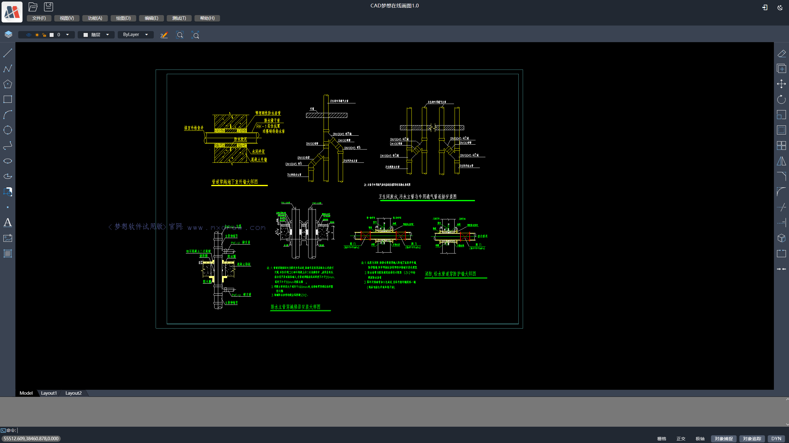
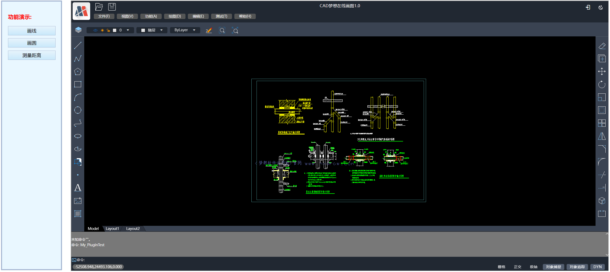
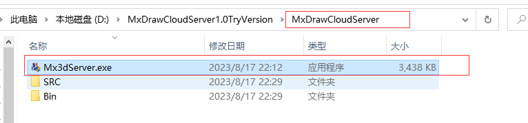
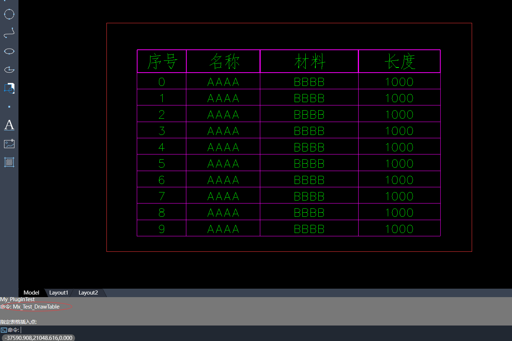

# MxCAD开发 项目介绍

该项目主要用于对集成MxCad在线编辑页面, 通过一些配置和插件实现自己的图纸编辑页面，

MxCad在线编辑前端项目是基于Vue3和vuetify3 UI框架实现的。

## H5版本

demo地址: https://demo.mxdraw3d.com:3000/mxcad/

打包源码下载位置: https://demo.mxdraw3d.com:3562/MxCADCode.7z

解压目录后, 分别有以下目录:

dist: MxCad在线编辑项目打包后的前端资源

MxCAD: 用于对 MxCad在线编辑项目项目二次扩展的插件

MxCADiframe: 通过iframe嵌入MxCad在线编辑项目的示例Demo

首先, 分别进入 MxCAD和MxCADiframe目录, 打开命令行运行命令`npm install`。

运行调试MxCAD项目命令: `npm run dev`

运行后的效果图:

运行调试MxCADiframe项目命令: `npm run serve`

直接打开可能无法获取图纸或者iframe提示localhost 已拒绝连接。

就访问 `http://localhost:8081/?debug=true`。

这是因为必须是同源的才行,

也就是说，要在自己项目的服务器下的同一端口去加载dist目录中的前端资源。

然后前端再通过iframe引入到自己的项目中。

运行后的效果图:

MxCad在线编辑前端项目整个二次开发的流程如下:

1.下载源码, 解压, 然后进入MxCAD目录, 运行`npm install`安装依赖。

2.运行`npm run dev` 调试开发自己的需求

3.运行`npm run build` 打包插件, dist目录下会生成一个js文件。

4.将整个dist目录下的前端资源拷贝到自己的项目的(调试)服务器中。

5.进入MxCADiframe项目运行`npm install`安装依赖。

6.在其src/components/Home.vue 中 iframe 的 src属性设置成刚刚拷贝到自己项目服务器的前端资源的地址

7.最后可以看看效果没有问题的话，按照MxCADiframe目录这个Demo的方式，在自己的前端项目中用iframe嵌入MxCad在线编辑项目。

以上只讲述了前端部分需要做的事，但是实际上我们需要后端的配合，并且实现一些必要的后端接口，整个项目完整的功能如上传图纸，保存dwg等等，都需要实现。

所以，我们还需要下载MxDraw云图开发包<https://www.mxdraw.com/download.html>解压

然后了解一下如何使用 MxDraw云图开发包入门文档:<https://help.mxdraw.com/?pid=32>

我们可以直接把整个dist的所有文件拷贝到`MxDrawCloudServer\SRC\TsWeb\public\mxcad`直接覆盖所有文件

然后双击运行Mx3dServer.exe

直接点击开始web服务再点击启动MxCAD

就可以看见完整的自己修改后的页面了，

其中MxCADiframe的按钮,打开的页面在MxCADCode.7z解压出来的MxCADiframe目录就是它的源代码。

通过上述了解你可以知道整个前端需要做的一些二次开发流程， 而对于需要自己实现上传图纸保存图纸的服务接口。
则需要详细阅读 MxDraw云图开发包相关文档:<https://help.mxdraw.com/?pid=32>

然后参考MxDraw云图开发包中对应的接口源码自己根据自己的需求实现

或者直接复用MxDraw云图开发包提供好的接口。

下面我们详细了解一下dist目录，通过配置和插件来实现二次开发的需求。

### 了解dist目录

dist目录是打包后的前端资源，我们可以直接拿到自己的服务器上部署。

MxCAD项目启动的用于调试的Node服务, 就是在访问dist目录下的index.html文件。

而MxCAD项目打包`npm run build`只是负责给dist目录下的plugins目录生成一个test.js文件(默认的示例test插件)。

几个重要配置文件:

mxUiConfig.json:

dist下 mxUiConfig.json文件配置, 主要是对UI进行一些简单配置。

title: 浏览器标题

headerTitle: 加上`<version>`自动替换成版本号

mTitleButtonBarData: 数组元素中prompt表示提示， cmd表示一个命令，点击按钮会执行一个命令

mRightButtonBarData和mLeftButtonBarData: isShow表示是否显示

mMenuBarData: list菜单列表 list中可以一直嵌套list 形成多级菜单

footerRightBtnSwitchData: ["栅格", "正交", "极轴","对象捕捉", "对象追踪", "DYN"] 显示对应名称的按钮，空数组就不显示

更多配置直接看配置文件, 有详细说明。

mxServerConfig.json:

uploadFileConfig: 是基于[WebUploader](http://fex.baidu.com/webuploader/)实现的文件上次, 部分配置参数它，后端上传接口说明如下:

* baseUrl: 同一个后台服务器地址，下述相对接口都是基于同一服务器地址
默认的后台服务源码位置在云图开发包中的位置: 
windows:
 
linux:

* fileisExist: 该接口返回data.ret === "fileAlreadyExist" 表示通过md5检查文件文件已存在秒传， 不是则需要上传。
该POST请求会携带两个参数{ fileHash："文件md5", filename: "文件名称" }可自行根据请求实现相应的的后端逻辑
默认的上传服务相关接口实现在云图开发包中的位置:

windows同理

* chunkisExist: 该POST接口请求携带参数
              {
                chunk: "分片",
                chunks: "总分片",
                fileName: "文件名称",
                fileHash: "文件md5",
                size: "分片文件大小",
              }
              后端返回 data.ret === "chunkAlreadyExist" 表示分片已存在否则表示不存在。
* mxfilepath: 表示上传图纸文件并转换成mxweb文件格式的文件存放在服务器静态资源目录下的哪个目录中，
            后端保存到该位置的文件必须是这样的路径必须是这样的:
            fileHash + "." + type + ".mxweb"
            fileHash表示cad图纸源文件的md5值
            type表示cad图纸的原文件后缀名

* saveDwgUrl: 保存DWG文件服务地址，该接口如何实现后续可以提供开发包
默认保存文件Node服务所在位置: 
* wasmConfig：这里的配置就区分一下使用哪个wasm相关文件,具体看dist中的配置文件有详细说明

插件的配置文件 plugins/config.json:

plugins: 就是存放插件名称的文件，它会按照先后顺序依次加载对应当前目录下的js对应名称的脚本， 如有一个plugins/test.js 就填写一个test

而MxCAD目录就是为了创建dist/plugins中对应的js文件
如图:

MxCAD目录说明:

* 基于vite 可通过`npm run dev` 直接运行启动服务器浏览dist目录的页面，并且修改MxCAD中.ts、.vue文件会自动编译, 自动刷新页面。

* 基于vite 需要手动运行`npm run build` 打包dist目录， 打包后dist目录直接放在dist/plugins中。

* `import` 引入 mxcad、mxdraw、vue 实际使用的是dist打包后的前端资源中的，而不是一个全新的mxcad、mxdraw、vue

* MxCAD目录下vite.config.ts 和 dist/plugins/config.json中的plugins 的配置要对应上

提示: 二次开发时可以阅读[mxcad前端库的文档](https://mxcadx.gitee.io/mxcad_docs/zh/)和[mxdraw前端库的文档](https://mxcadx.gitee.io/mxdraw_docs/) 参考API和入门文档，实现一些自己的需求

在MxCAD目录下src中我们提供了大量的通过mxcad库实现各种功能的测试用例, 可以在调试的时候运行它们,
可以通过页面上的测试按钮或者命令行输入命令

其某个按钮上的功能对应的代码也可以通过命令在源码中搜索找到对应的实现

开发完成插件后，运行`npm run build` 就可以打包到dist/plugins目录下了

现在我们只需要把dist目录放在服务器上, 通过iframe的嵌入

而MxCADiframe项目就是这样一个简单的demo，你可以参考它完成简单的将dist前端资源集成到你的项目中。

在MxCAD目录中的src目录下
有一个iframe.ts 文件，与MxCADiframe项目中的postMessage一一对应。

我们推荐用这种方式来实现自定义的需求和集成部署。

## electron版本

我们提供有electron版本来实现桌面应用。

下载地址： https://gitee.com/mxcadx/mxdraw-article/blob/master/MxCad项目二次开发插件集成/MxCADAppElectron.zip

下载解压后, 按照依赖`npm install`然后运行`npm run dev` 就可以启动electron项目了。

对于electron版本，前端二次开发的插件(就是上述MxCAD目录生成的js文件)没有任何变动, 

我们只需要将这个打包到dist/plugins下对应的js脚本复制到现在下载解压的electron项目项目的dist/2d/dist/plugins目录下覆盖就可以了。

唯一的区别就算electron版本在window上新增了MxElectronAPI对象, 提供了和主线程通信的能力。

我们可以在写前端二次开发的插件时通过MxElectronAPI来判断是否是electron环境。

而electron项目，也存在自己的插件, 用于electron主线程的一些二次开发需求。

插件用ts文件编写，基于vite 打包 对应的vite 配置: vite.plugins.config.ts

创建一个新的electron项目插件步骤:

1.创建src/plugins 目录， 如果存在则无需创建

2.创建一个插件目录 如testPlugin目录, 然后在该目录下创建一个index.ts作为该插件入口文件

3.vite.plugins.config.ts 新增插件入口配置pluginEntryFileName: ["plugins/testPlugin/index.ts"]

4.运行命令调试: `dev:plugins`

5.运行命令打包: `build:plugins`

6.如果在testPlugin创建preload.ts 并默认导出一个对象，这个对象存放是用来与页面通信的API。

这里如果比较难理解可以参考预加载脚本：https://www.electronjs.org/zh/docs/latest/tutorial/tutorial-preload

这里的preload.ts就是预加载脚本。

其默认导出的对象就是在通过`contextBridge.exposeInMainWorld`定义的前端 window.MxElectronAPi.插件目录名称(命名空间)对象， 如现在创建的testPlugin目录，那么前端访问就是window.MxElectronAPi.testPlugin 就是这个默认导出的对象

同理preload2d.ts导出的对象会覆盖preload.ts导出对象中属性相同的值,

但是preload2d.ts只在显示2d图纸的页面中有效。

preload3d.ts与preload2d.ts不同的是它只作用于3d显示的页面。

preload.ts则是公共的

7.plugins可以存在很多插件， 它下面的每一个目录都是一个插件,

这个插件的目录名就是命名空间名称。 前端页面访问的对象也是window.MxElectronAPI.命名空间名称

在electron项目插件的ts文件中，我们保留了mxAppContext上下
你可以通过 `global.mxAppContext`访问，目前挂载了几个属性和方法:
  getMainWindow,
  showMessage,
  showMessageBoxSync,
  MainTabs
在ts中有对应的类型提示和说明。

以下electron项目中对应目录的描述：
| 路径 | 描述 | 提醒 |
|-------|-------|-------|
| dist | 前端打包的项目资源 | 目录下有2d、3d等目录，其中2d和3d内还存在一个dist目录， 这个dist目录就是上文中提到的打包后前端资源，不过它是electron版本，但是目录结构是一模一样的， 我们只需要把上文中的生成的dist/plugins/test.js覆盖掉electron版本中对应dist/plugins/test.js, 然后查看config.json中是否存在对应的配置 |
| dist-electron | 主线程打包的代码 | 不建议直接修改这里的代码，因为随时都可能更新替换 |
| rendererTypes | window.MxElectronAPI的ts类型定义 | 可以在前端使用，提供类型定义和说明描述 |
| src/plugins | 插件目录 | 每一个目录下的index.ts都是入口 |
| vite.plugins.config.ts | vite的打包配置 | 每一个新的创建目录都要在这里记录，如果你稍微了解vite打包那么可以根据自己的需求作出调整， 但是最终输出文件的结构位置一定不可以变，不然无法加载插件 |

对于有二次开发需求现有配置或者插件无法满足时，可以给我们反馈，后续会逐步完善。