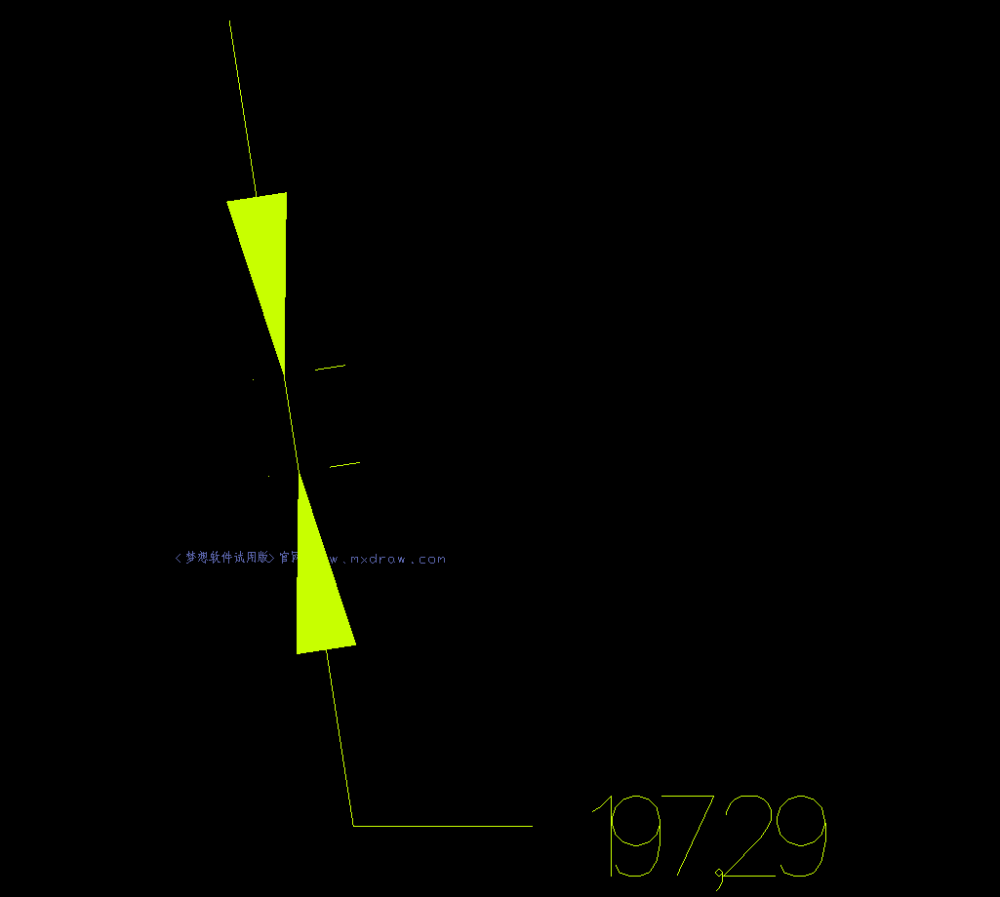

# mxcad参数化绘图

mxcad 提供了参数化绘制的功能, 我们可以通过查看继承自[McDbEntity](https://mxcadx.gitee.io/mxcad_docs/api/classes/2d.McDbEntity.html)的类的所有实例

它们都可以进行参数化的绘图

首先我们应该在页面上显示一张图纸, 请根据[mxcad入门文档](https://mxcadx.gitee.io/mxcad_docs/zh/1.%E6%8C%87%E5%8D%97/1.%E5%BF%AB%E9%80%9F%E5%85%A5%E9%97%A8.html)的说明

或者通过查看 [github](https://github.com/mxcad/mxcad_docs/tree/master/examples) | [gitee](https://gitee.com/mxcadx/mxcad_docs/tree/master/examples) 存储的初始化各种示例项目查看代码

来实现显示图纸的页面。

参数化绘制一个CAD中的点:

```ts
import { MxCpp, McDbPoint, McCmColor } from "mxcad"
const mxcad = MxCpp.App.getCurrentMxCAD()
const point = new McDbPoint()
const color = new McCmColor()
color.setRGB(0, 255, 255)
point.trueColor = color
point.setPosition(200, 200)
mxcad.drawEntity(point)
```

效果图:


绘制多行文字

```ts
import { MxCpp, McGePoint3d, McCmColor, McDb, McDbMText } from "mxcad"
const mxcad = MxCpp.App.getCurrentMxCAD()
const mText = new McDbMText()
const textId = mxcad.drawEntity(mText)
const text = textId.getMcDbEntity() as McDbMText
text.attachment = McDb.AttachmentPoint.kTopLeft
text.contents = "内容 \\P 内容"
text.location = new McGePoint3d(10, 20)
text.trueColor = new McCmColor(255, 0, 255)
text.textHeight = 10
mxcad.updateDisplay()
```

效果图:


绘制单行文本

```ts
import { MxCpp, McGePoint3d, McCmColor, McDb, McDbText } from "mxcad"
const mxcad = MxCpp.App.getCurrentMxCAD()
const text = new McDbText()
text.widthFactor = 1
text.horizontalMode = McDb.TextHorzMode.kTextCenter
text.verticalMode = McDb.TextVertMode.kTextBottom
text.textString = "内容"
text.position = new McGePoint3d(-10, -20)
text.trueColor = new McCmColor(255, 0, 255)
text.height = 10
mxcad.drawEntity(text)
mxcad.updateDisplay()
```

效果图:


绘制对齐标注尺寸

```ts
import { MxCpp, McGePoint3d, McCmColor, McDb, McDbAlignedDimension } from "mxcad"
const mxcad = MxCpp.App.getCurrentMxCAD()
const mDimension = new McDbAlignedDimension()
const dimensionId = mxcad.drawEntity(mDimension)
const dimension = dimensionId.getMcDbEntity() as McDbAlignedDimension
dimension.xLine1Point = new McGePoint3d(0, 255)
dimension.xLine2Point = new McGePoint3d(30, 60)
dimension.dimLinePoint = new McGePoint3d(88, 88)
dimension.textAttachment = McDb.AttachmentPoint.kTopLeft
dimension.trueColor = new McCmColor(200, 255, 0)
dimension.oblique = 0
mxcad.updateDisplay()
```

效果图:


绘制旋转标注尺寸

```ts
import { MxCpp, McGePoint3d, McCmColor, McDb, McDbRotatedDimension } from "mxcad"
const mxcad = MxCpp.App.getCurrentMxCAD()
const mDimension = new McDbRotatedDimension()
const dimensionId = mxcad.drawEntity(mDimension)
const dimension = dimensionId.getMcDbEntity() as McDbRotatedDimension
dimension.xLine1Point = new McGePoint3d(100, -137)
dimension.xLine2Point = new McGePoint3d(161,30)
dimension.dimLinePoint = new McGePoint3d(80, -60)
dimension.textAttachment = McDb.AttachmentPoint.kTopLeft
dimension.textRotation = 0.23
dimension.trueColor = new McCmColor(200, 255, 0)
dimension.oblique = 0
dimension.rotation = 0
mxcad.updateDisplay()
```

效果图:


绘制直线

```ts
import { MxCpp, McCmColor, McDbLine } from "mxcad"
const mxcad = MxCpp.App.getCurrentMxCAD()
const line = new McDbLine(0, 0, 0, -80, -80, 0)
line.trueColor = new McCmColor(255, 0, 0)
mxcad.drawEntity(line)
```

效果图:


绘制圆

```ts
import { MxCpp, McCmColor, McDbCircle } from "mxcad"
const mxcad = MxCpp.App.getCurrentMxCAD()
const circle = new McDbCircle(-100, 300, 0, 20)
circle.trueColor = new McCmColor(255, 0, 0)
mxcad.drawEntity(circle)
```

效果图:


绘制多义线

```ts
import { MxCpp, McGePoint3d, McDbPolyline } from "mxcad"
const mxcad = MxCpp.App.getCurrentMxCAD()
const polyline = new McDbPolyline()
polyline.isClosed = false
polyline.constantWidth = 10
polyline.addVertexAt(new McGePoint3d(100, 100))
polyline.addVertexAt(new McGePoint3d(200, 100), 0.2, 1, 5, 1)
polyline.addVertexAt(new McGePoint3d(100, 200), 0.2, 5, 1, 2)
mxcad.drawEntity(polyline)
```

效果图:


绘制圆弧:

```ts
import { MxCpp, McGePoint3d, McDbArc, McCmColor } from "mxcad"
const mxcad = MxCpp.App.getCurrentMxCAD()
const arc = new McDbArc()
arc.center = new McGePoint3d(-100, -100),
arc.radius = 20
arc.startAngle = Math.PI / 2
arc.endAngle = Math.PI * 3 / 2
arc.trueColor = new McCmColor(255, 233, 0)
mxcad.drawEntity(arc)
```

效果图:


绘制椭圆:

```ts
import { MxCpp, McGePoint3d, McDbEllipse, McCmColor, McGeVector3d } from "mxcad"
const mxcad = MxCpp.App.getCurrentMxCAD()
const ellipse = new McDbEllipse()
ellipse.center = new McGePoint3d(-200, -200),
ellipse.majorAxis = new McGeVector3d(0, 300, 0)
ellipse.minorAxis = new McGeVector3d(33, 0, 0)
ellipse.radiusRatio = 0.5
ellipse.startAngle = Math.PI / 2
ellipse.endAngle = Math.PI * 3 / 2
ellipse.trueColor = new McCmColor(255, 233, 0)
mxcad.drawEntity(ellipse)
```

效果图:


如果, 上述位置属性是用户通过点击或者输入框输入。

mxcad提供了这样一套用于获取用户输入并在绘制中得到输入的机制。

最频繁的应该是鼠标点击输入, 如果通过鼠标点击获取CAD图纸中的坐标位置:

```ts
import { MxCADUiPrPoint } from "mxcad"
const getPoint = new MxCADUiPrPoint()
const point = await getPoint.go()
console.log(point)
```

上述代码打印的就是一个坐标点了, 其坐标点是用户通过鼠标点击获取到的对应的图纸坐标位置。

而用户输入也可能是通过输入框输入值, 来确定除了坐标以外的其他参数:

```ts
import { MxFun } from "mxdraw"
const input = document.createElement("input")
input.addEventListener("keydown", (e: KeyboardEvent) => {
    // 设置传输命令行消息数据
    MxFun.setCommandLineInputData((e.target as HTMLInputElement).value, e.keyCode);
}) 
document.body.appendChild(input)
```

mxcad中引用了mxdraw 下载依赖时会自动下载, 所有我们只要安装了mxcad就可以使用mxdraw

如上代码所示, 我们传入用户输入的内容和对应按键的keyCode值

```ts
const getInt = new MxCADUiPrInt()
const getKey = new MxCADUiPrKeyWord
const getStr = new MxCADUiPrString()
getInt.setMessage("提示用户输入数字:")
const intVal = await getInt.go()
console.log(intVal)
getKey.setMessage("提示用户关键词 A、 B、 C:")
getKey.setKeyWords("A B C")
const keyVal = await getKey.go()
console.log(keyVal)
getStr.setMessage("提示用户输入字符串:")
const strVal = await getStr.go()
console.log(strVal)
```

上述代码会在用户输入对应类型的数据后按下回车键(Enter或者Esc)才会往下执行, 通过setMessage设置提示

最终得到用户输入的数据, 通过这些数据进行参数化绘图。

最后这些设置的用户提示通过下面代码获得:

```ts
import { MxFun } from "mxdraw"
MxFun.listenForCommandLineInput(({ msCmdTip, msCmdDisplay, msCmdText }) => {
    console.log(msCmdTip, msCmdDisplay, msCmdText)
 }
);
```

如果你无法理解上述某个函数的意思 可以在[mxdraw API文档](https://mxcadx.gitee.io/mxdraw_api_docs/)或者[mxcad API文档](https://mxcadx.gitee.io/mxcad_docs/api/README.html)中查看对应的APi说明

下面简单实现一个的参数化绘制文字的流程:

```ts
import { MxFun } from "mxdraw"
import { MxCADUiPrInt, MxCADUiPrKeyWord, MxCADUiPrString, MxCADUiPrPoint, McDbText, MxCpp } from "mxcad"
MxFun.addCommand("Mx_draw_Text", async ()=> {
    const getInt = new MxCADUiPrInt()
    const getKey = new MxCADUiPrKeyWord()
    const getStr = new MxCADUiPrString()
    const getPoint = new MxCADUiPrPoint()
    const text = new McDbText()
    getPoint.setMessage("请点击确定文字位置")

    const position = await getPoint.go()
    if(!position) return
    text.position = position

    getInt.setMessage("请输入文字高度")
    const height = await getInt.go()
    if(!height) return
    text.height = height

    getKey.setMessage("选择水平对齐方式 快捷键 L: 左对齐 C: 居中对齐 R: 右对齐 A: 水平对齐 M: 垂直中间对齐 F: 自适应")

    getKey.setKeyWords("L C R A M F")

    await getKey.go()
    if(getKey.isKeyWordPicked("L")) text.horizontalMode = McDb.TextHorzMode.kTextLeft
    if(getKey.isKeyWordPicked("C")) text.horizontalMode = McDb.TextHorzMode.kTextCenter
    if(getKey.isKeyWordPicked("R")) text.horizontalMode = McDb.TextHorzMode.kTextRight
    if(getKey.isKeyWordPicked("A")) text.horizontalMode = McDb.TextHorzMode.kTextAlign
    if(getKey.isKeyWordPicked("M")) text.horizontalMode = McDb.TextHorzMode.kTextMid
    if(getKey.isKeyWordPicked("F")) text.horizontalMode = McDb.TextHorzMode.kTextFit

    getStr.setMessage("请输入文字内容")
    const str = await getStr.go()
    if(!str) return
    text.textString = str
    const mxcad = MxCpp.App.getCurrentMxCAD()
    mxcad.drawEntity(text)
})
```

本文提供的源码下载地址: https://gitee.com/mxcadx/mxdraw-article/tree/master/mxcad参数化绘图/demo.zip
