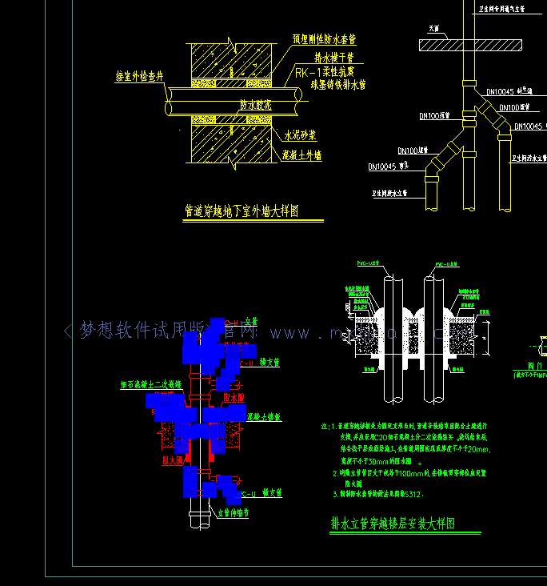

# 选择图形编辑

选择图形进行编辑, 对图形的夹点进行编辑是CAD中的基础功能。

## 选择图形编辑功能

mxcad在默认配置下是开启了选择图形的编辑功能, 我们可以通过mxdraw提供的`MxFun.setIniset`实现各种初始化配置, 配置参数参考[iniConfig](https://mxcadx.gitee.io/mxdraw_api_docs/interfaces/iniConfig.html)

```ts
import { MxFun } from "mxdraw"
MxFun.setIniset({
    // 启动夹点编辑功能, 开启单选图形(mxcad默认开启)
    "EnableGripEidt": true,
    // 开启多选
    "multipleSelect": true
})
```

通过如上设置, 我们就可以通过鼠标对应的图形进行编辑和选择。

获取当前选择的图形:

```ts
import { MxCpp, MxCADUtility, McObjectId, McObjectIdType } from "mxcad"
// 需要等待createMxCad完成创建控件后才能得到
const objIds = MxCADUtility.getCurrentSelect()
objIds.forEach((objId: McObjectId)=> {
    if(objId.type === McObjectIdType.kMxCAD) {
        console.log("CAD图形对象", objId.getMcDbEntity())
    }
    if(objId.type === McObjectIdType.kMxDraw) {
        console.log("绘图对象", objId.getMxDbEntity())
    }
})
```

我们也可以通过[MxCADSelectionSet](https://mxcadx.gitee.io/mxcad_docs/api/classes/2d.MxCADSelectionSet.html)进行选择:

```ts
import { MxCADSelectionSet, MxCADResbuf, MxCADUiPrPoint } from "mxcad"
const ss = new MxCADSelectionSet();
//选择所有图形元素
ss.allSelect();
ss.forEach(()=> {
    let ent = id.getMcDbEntity();
    if (!ent) return;
    console.log(ent)
})

const filter = new MxCADResbuf();
// 添加对象类型，选择集只选择文字类型的对象
filter.AddMcDbEntityTypes("TEXT,MTEXT");
ss.allSelect(filter);
// 第一种方式获取对象id集合
ss.getIds()
// 第二种方式获取对象id集合
ss.forEach((id)=> {
    let ent = id.getMcDbEntity();
    if (!ent) return;
    console.log(ent)
})

// 通过单个点选择
const getPoint = new MxCADUiPrPoint()
getPoint.go((point)=> {
    if(!point) return;
    // 加filter过滤选择集, 这里只会选择文字对象
    const index = ss.pointSelect(point.x, point.y, filter)
    const objId = ss.item(index)
    const ent = objId.getMcDbEntity()
    console.log(ent)
})

// 通过鼠标选择多个对象
// 加filter过滤选择集, 这里只会选择文字对象
ss.userSelect("框选需要的对象", filter).then((is)=> {
    if(is) {
        // 得到框选的两个选择点
        const { pt1, pt2 } =  ss.getSelectPoint()
        ss.getIds()
        ss.forEach((id)=> {
            let ent = id.getMcDbEntity();
            if (!ent) return;
            console.log(ent)
        })
    }
})
```

还可以手动将图形对象ID添加到当前选择中:

```ts
import { McApp } from "mxcad"
let mxcad = MxCpp.getCurrentMxCAD();
let id = mxcad.drawLine(0,0,1000,1000);
mxcad.addCurrentSelect(id);
```

选择编辑事件:

```ts
import { MxCpp } from "mxcad"
// 当图形被当前选中时会触发`selectChange`事件并回调当前已选中的id对象列表
MxCpp.getCurrentMxCAD().on("selectChange", (ids: McObjectId[])=> {})

// 当我们点击某个CAD图形并对其进行编辑或者夹点拖动后, mxdraw会触发`databaseModify`事件表示该图纸已被修改, 并且该事件只会触发一次
const mxdraw = MxCpp.getCurrentMxCAD().getMxDrawObject()
mxdraw.on("databaseModify", ()=> {
    console.log("图纸被修改")
})
```


下面是一个将选中的图形颜色变成红色的完整代码示例, 可以根据如下代码理解图形的选择:

```ts
import { McCmColor, McObjectId, MxCpp, createMxCad } from "mxcad"
import { MxFun } from "mxdraw"
window.onload = async () => {
    const mode = "SharedArrayBuffer" in window ? "2d" : "2d-st"
    MxFun.setIniset({
        // 启动夹点编辑功能, 开启单选图形(mxcad默认开启)
        "EnableGripEidt": true,
        // 开启多选
        "multipleSelect": true
    })
    await createMxCad({
        canvas: "#mxcad",
        locateFile: (fileName) => {
            return new URL(`/node_modules/mxcad/dist/wasm/${mode}/${fileName}`, import.meta.url).href
        },
        fileUrl: new URL("../public/test2.mxweb", import.meta.url).href,
        fontspath: new URL("../node_modules/mxcad/dist/fonts", import.meta.url).href,
    })
    let oldColors: (McCmColor | undefined)[] =  []
    let oldIds: McObjectId[] = []
    MxCpp.getCurrentMxCAD().on("selectChange", (ids: McObjectId[])=> {
        // 还原颜色
        oldIds.forEach((id, index)=> {
            const color = oldColors[index]
            const ent = id.getMcDbEntity()
            if(!ent) return
            if(color) ent.trueColor = color
        })
        // 选中更改颜色
        oldColors = ids.map((id)=> {
            const ent = id.getMcDbEntity()
            if(!ent) return
            const color =  ent.trueColor.clone()
            ent.trueColor = new McCmColor(255, 0, 0)
            return color
        })
        oldIds = ids
    })
}

```

效果图:


本文提供的源码下载地址: <https://gitee.com/mxcadx/mxdraw-article/tree/master/mxcad选择图形编辑/demo.zip>
