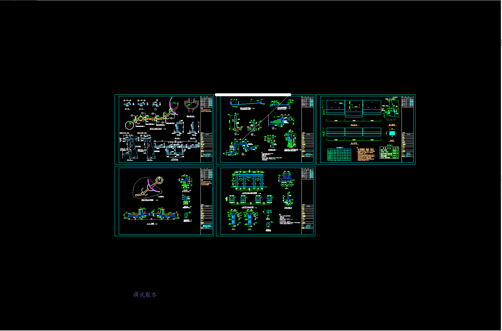
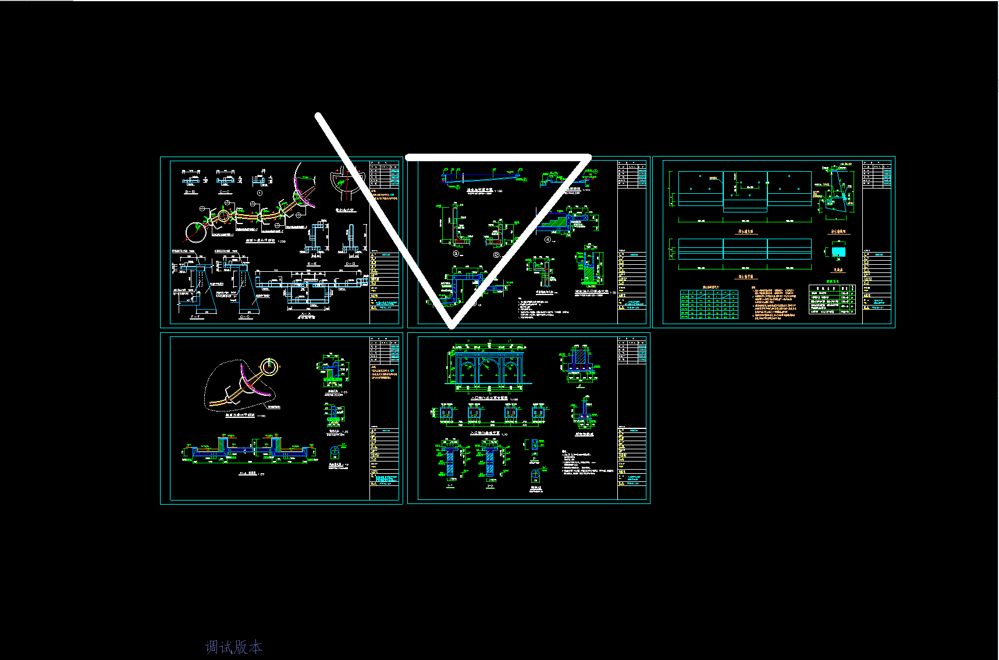
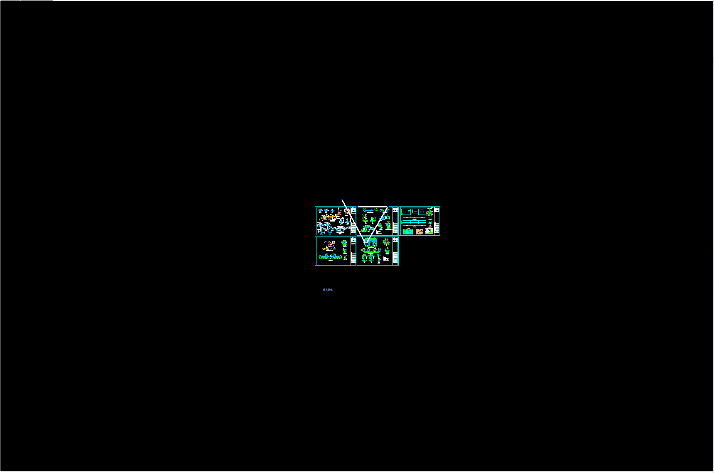

# mxdraw如何配合three.js实现带线宽的线段

首先,mxdraw的图形是有线宽属性的，但是在连续线段可能会存在一些问题，或者你希望用three.js来实现一些自定义的图形。

那么我们就可以使用mxdraw提供的MxDbEntity来实现这样一个带线宽的线段。

我们先把最基本需要重写的函数写出来:

```ts
import { McGiWorldDraw, MxDbEntity } from "mxdraw"
class MxDbLine extends MxDbEntity {
    getTypeName(): string {
        return "MxDbLine"
    }
    worldDraw(pWorldDraw: McGiWorldDraw): void {

    }
    getGripPoints(): THREE.Vector3[] {
        return []
    }
    moveGripPointsAt(index: number, offset: THREE.Vector3): boolean {
       return true
    }
    dwgIn(obj: any): boolean {
       this.onDwgIn(obj)
       return true
    }
    dwgOut(obj: any): object {
        this.onDwgOut(obj)
        return obj
    }
}
```

现在我们就有了一个MxDbLine类，用来表示它是一条线段，但是它没有任何与线段有关的数据,我们要先定义一些线段数据。

```ts
class MxDbLine extends MxDbEntity {
    // ...
    points: THREE.Vector3[] = []
    dwgIn(obj: any): boolean {
       this.onDwgIn(obj)
       this.dwgInHelp(obj, ["points"])
       return true
    }
    dwgOut(obj: any): object {
        this.onDwgOut(obj)
        this.dwgOutHelp(obj, ["points"])
        return obj
    }
}
```

现在我们有了points数据了 这些点可以构成一段段的线段。

但是它现在还不能在画布中渲染， 这时因为我们还需要用three.js来实现一个带线宽的线段结合体，这个如何实现呢？

首先，我们可以在three.js示例中找到Line2 这样相关的类，它就可以实现带线宽的线段。

我们先安装:

```sh
npm i three@0.113.2
```

我们现在只需要Line2 LineGeometry 和 LineMaterial这三个类，你可以不用安装three@113.2的依赖，只需要找到它对应示例的文件，引入到项目中就可以了


以下是具体的实现代码:

```ts
import { Line2 } from 'three/examples/jsm/lines/Line2'
import { LineGeometry } from 'three/examples/jsm/lines/LineGeometry'
import { LineMaterial } from 'three/examples/jsm/lines/LineMaterial'
export class MxDbLine extends MxDbEntity { 
      // ...
     // 临时存放的material
     material: LineMaterial
     worldDraw(pWorldDraw: McGiWorldDraw): void {
        const material = new LineMaterial()
        this.material = material
        const geometry = new LineGeometry()
        // 得到mxdraw中使用的three.js
        const THREE = MxFun.getMxFunTHREE()
        // 设置颜色
        material.color = new THREE.Color(this.color)

        // line2必须设置的分辨率
        const canvas = MxFun.getCurrentDraw().getCanvas()
        material.resolution.set( canvas.width, canvas.height)
        // 设置透明 因为这样才能覆盖底层的cad图纸
        material.transparent = true

        // 设置点向量位置，line2需要这样设置
        const positions: number[] = []
        for(let i = 0; i < this.points.length; i++) {
            positions.push(this.points[i].x, this.points[i].y, (this.points[i] as any)?.z || 0)
        }
        geometry.setPositions(positions)

        const line2 = new Line2(geometry, material)
        // 最后把这个three.js生成的线段绘制出来
        pWorldDraw.drawEntity(line2)
    }
}

```

现在我们基本上用three.js示例中提供的Line2类绘制线段，MxDbLine也可以完整的显示一条线段了，但是它还没有宽度。

在MxDbEntity中提供了dLinewidth属性用于表示线宽， 用lineWidthByPixels属性表示线宽是否始终跟随屏幕宽度，也就是画布缩放，线的宽度始终不变

当lineWidthByPixels为false时就是另一种three.js中的坐标系宽度，这种宽度是固定的了，不会随着画布缩放而变化。

我们要实现这两种宽度还需要了解到MxDbEntity重写方法onViewChange 当画布缩放时onViewChange 就会执行。

还需要了解的是，我们要将当前的屏幕坐标长度转成three.js坐标系长度，在mxdraw中提供了MxFun.screenCoordLong2World来转换。

默认我们dLinewidth都是跟随屏幕的宽度，我们需要先记录当前绘制这条线段时，1屏幕像素转成three.js坐标系长度的值是多少。

然后后面我们需要根据lineWidthByPixels属性判断是用跟随屏幕像素的宽度还是three.js坐标系一样的固定宽度。

如果lineWidthByPixels = false 那么我们就可以通过当时绘制时记录的three.js坐标系长度的值 去比上现在这个时候的1屏幕像素下的three.js坐标系长度。

这样我们就得到了一个线宽比，用线宽比去乘以目前设置的dLinewidth宽度，就算我们实现需要的宽度了

如果lineWidthByPixels = true 我们就不用这么麻烦了，dLinewidth就算我们需要的宽度。

具体的代码如下：

```ts
export class MxDbLine extends MxDbEntity {
    // 记录1屏幕像素下three.js的长度 比例
     _lineWidthRatio: number
    //  更新实际的线宽
    updateLineWidth() {
        if(!this._lineWidthRatio) {
            this._lineWidthRatio = MxFun.screenCoordLong2World(1)
        }
        this.material.linewidth =  this.lineWidthByPixels ? this.dLineWidth :  this.dLineWidth *  this._lineWidthRatio / MxFun.screenCoordLong2World(1)
    }
     worldDraw(pWorldDraw: McGiWorldDraw): void {
        // ...
        this.updateLineWidth()
        // ...
     }
    //  在画布视图缩放变化时立即触发更新重写渲染
     onViewChange() {
        // 只有当时以three.js长度为单位的时候才这样立即更新去调整宽度
        if(!this.lineWidthByPixels) {
            this.setNeedUpdateDisplay()
            MxFun.updateDisplay()
        }
        return true
    }
    // 顺便我们把夹点操作移动给写上，这样就可以移动每一个向量点来来改变线段了
    getGripPoints(): THREE.Vector3[] {
        return this.points
    }
    moveGripPointsAt(index: number, offset: THREE.Vector3): boolean {
        this.points[index] = this.points[index].clone().add(offset)
       return true
    }
    //  _lineWidthRatio属性必须一直存在 这样线宽才算正确的
    dwgIn(obj: any): boolean {
       this.onDwgIn(obj)
       this.dwgInHelp(obj, ["points", "_lineWidthRatio"])
       return true
    }
    dwgOut(obj: any): object {
        this.onDwgOut(obj)
        this.dwgOutHelp(obj, ["points", "_lineWidthRatio"])
        return obj
    }
}

```

最后就是使用我们写好的MxDbLine类

```ts
import { MxFun, MrxDbgUiPrPoint } from "mxdraw"
const drawLine = ()=> {
    const line = new MxDbLine()
    line.dLineWidth = 10
    const getPoint = new MrxDbgUiPrPoint()
    // 这是绘制过程中设置的动态绘制函数
    getPoint.setUserDraw((currentPoint, pWorldDraw)=> {
        if(line.points.length === 0) return
        if(line.points.length >= 2) {
            pWorldDraw.drawCustomEntity(line)
        }
        pWorldDraw.drawLine(currentPoint, line.points[line.points.length - 1])
    })
    getPoint.goWhile(()=> {
        // 鼠标左键点击
        line.points.push(getPoint.value())
    }, ()=> {
        // 鼠标右键结束绘制
        MxFun.getCurrentDraw().addMxEntity(line)
    })
}
```



这时绘制完成后的效果：



把line.lineWidthByPixels 设置成false 当我们缩放画布时，线段就不会始终是屏幕宽度了，而是当时绘制时的three.js实际宽度.




下面给MxDbLine的完整代码:

```ts
import { McGiWorldDraw, McGiWorldDrawType, MxDbEntity, MxFun } from "mxdraw"
import { Line2 } from 'three/examples/jsm/lines/Line2'
import { LineGeometry } from 'three/examples/jsm/lines/LineGeometry'
import { LineMaterial } from 'three/examples/jsm/lines/LineMaterial'

export class MxDbLine extends MxDbEntity {
    points: THREE.Vector3[] = []
 
    
    getTypeName(): string {
        return "MxDbLine"
    }
    material: LineMaterial
    _lineWidthRatio: number
    worldDraw(pWorldDraw: McGiWorldDraw): void {
        const material = new LineMaterial()
        this.material = material
        const geometry = new LineGeometry()
        // 得到mxdraw中使用的three.js
        const THREE = MxFun.getMxFunTHREE()
        // 设置颜色
        material.color = new THREE.Color(this.color)
      
        // line2必须设置的分辨率
        const canvas = MxFun.getCurrentDraw().getCanvas()
        material.resolution.set( canvas.width, canvas.height)
        // 设置透明 因为这样才能覆盖底层的cad图纸
        material.transparent = true
        // 更新线宽
        this.updateLineWidth()

        // 设置点向量位置，line2需要这样设置
        const positions: number[] = []
        for(let i = 0; i < this.points.length; i++) {
            positions.push(this.points[i].x, this.points[i].y, (this.points[i] as any)?.z || 0)
        }
        geometry.setPositions(positions)

        const line2 = new Line2(geometry, material)

        pWorldDraw.drawEntity(line2)
    }
    updateLineWidth() {
        if(!this._lineWidthRatio) {
            this._lineWidthRatio = MxFun.screenCoordLong2World(1)
        }
        this.material.linewidth =  this.lineWidthByPixels ? this.dLineWidth :  this.dLineWidth *  this._lineWidthRatio / MxFun.screenCoordLong2World(1)
    }
    onViewChange() {
        this.setNeedUpdateDisplay()
        MxFun.updateDisplay()
      
        return true
    }
    getGripPoints(): THREE.Vector3[] {
        return this.points
    }
    moveGripPointsAt(index: number, offset: THREE.Vector3): boolean {
        this.points[index] = this.points[index].clone().add(offset)
       return true
    }
    dwgIn(obj: any): boolean {
       this.onDwgIn(obj)
       this.dwgInHelp(obj, ["points", "_lineWidthRatio"])
       return true
    }
    dwgOut(obj: any): object {
        this.onDwgOut(obj)
        this.dwgOutHelp(obj, ["points", "_lineWidthRatio"])
        return obj
    }
}
```
