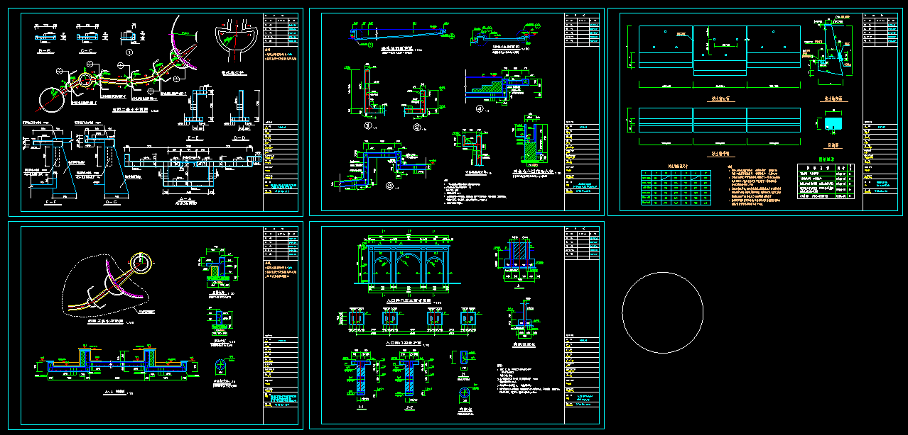
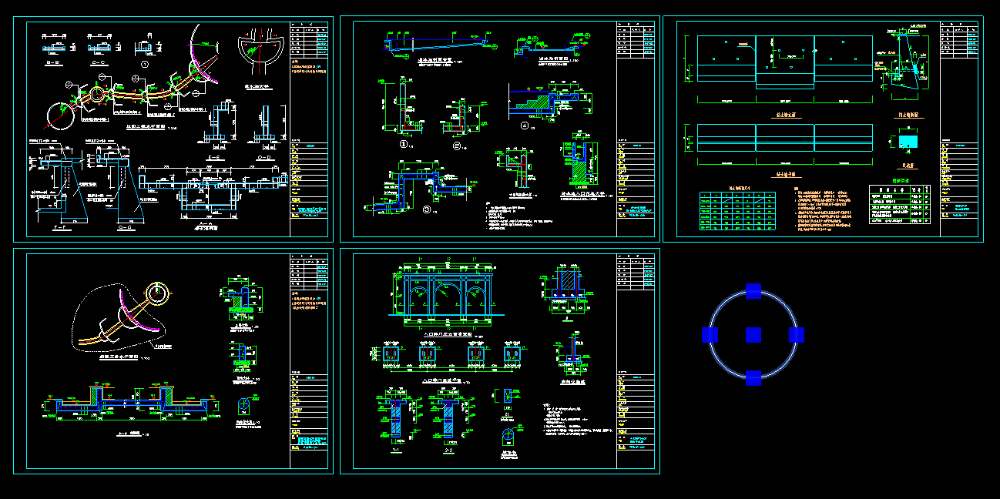

# mxdraw库实现autocad中的圆

mxdraw库是一款用于绘制CAD图形的JavaScript库，它提供了一系列的图形形状类，可以实现类似于Autocad的绘图功能。

其中，[MxDbCircleShape圆(弧)形状类](https://mxcadx.gitee.io/mxdraw_api_docs/classes/MxDbCircleShape.html)是mxdraw库中用于绘制圆形（弧形）的形状类。

基于它, 我们可以实现类似autocad绘制圆的功能。

首先我们先通过继承类的方式，为圆提供可以改变这个圆的夹点。

```ts
import { MxDbCircleShape } from "mxdraw";
class MxDbCircle extends MxDbCircleShape {
   /**是否闭合到中心位置 */ 
  isClosedToCenter = false
  /**
   * 返回自定义对象的夹点.
   * @param
   * @returns Array<THREE.Vector3>
   */
  getGripPoints() {
    const { x, y, z } = this.center;
    // 计算圆的上下左右夹点
    let upPoint = new THREE.Vector3(x, y + this.radius, z),
      downPoint = new THREE.Vector3(x, y - this.radius, z),
      leftPoint = new THREE.Vector3(x - this.radius, y, z),
      rightPoint = new THREE.Vector3(x + this.radius, y, z);

    return [this.center, upPoint, downPoint, leftPoint, rightPoint];
  }
  /**
   * 移动自定义对象的夹点.
   * @param
   * @returns boolean
   */
  moveGripPointsAt(index: number, offset: THREE.Vector3) {
    const [center, upPoint, downPoint, leftPoint, rightPoint] =
      this.getGripPoints();
    // 改变上下左右的夹点则改变radius半径
    if (index === 0) this.center = center.add(offset);
    if (index === 1) this.radius = upPoint.add(offset).distanceTo(this.center);
    if (index === 2)
      this.radius = downPoint.add(offset).distanceTo(this.center);
    if (index === 3)
      this.radius = leftPoint.add(offset).distanceTo(this.center);
    if (index === 4)
      this.radius = rightPoint.add(offset).distanceTo(this.center);
    return true;
  }
}
```

| 属性名              | 类型     | 描述                                       |
|---------------------|----------|--------------------------------------------|
| center              | Vector3  | 圆心坐标                                   |
| radius              | number   | 圆半径                                     |
| startAngle          | number   | 弧开始角度                                 |
| endAngle            | number   | 弧结束角度                                 |
| clockwise           | boolean  | 是否以顺时针方向创建（扫过）弧线             |
| isClosedToCenter    | boolean  | 是否闭合到中心位置                          |

需要注意的是，MxDbCircleShape继承自[MxDbEllipseShape](https://mxcadx.gitee.io/mxdraw_api_docs/classes/MxDbEllipseShape.html)，

因此MxDbCircleShape也拥有MxDbEllipseShape的所有属性。

我们只需要知道圆心和半径就可与直接绘制一个圆了。

在autocad中绘制圆的方式有很多方式, 这里就通过两种方式来绘制圆

## 两点绘制圆

```ts
import { MrxDbgUiPrPoint, MxFun, MxDbCircleShape, McEdGetPointWorldDrawObject, } from "mxdraw";
const drawCircleAtTwoPoints = async () => {
    const getPoint = new MrxDbgUiPrPoint();
    const circle = new MxDbCircle();
    // 直接确定圆心
    circle.center = await getPoint.go()
    getPoint.setUserDraw(
        (
            currentPoint: THREE.Vector3,
            pWorldDraw: McEdGetPointWorldDrawObject
        )=> {
            // 根据圆心和圆弧上任意一点确定半径
            circle.radius = circle.center.distanceTo(currentPoint)
            pWorldDraw.drawCustomEntity(circle);
            // 再绘制一根圆弧和圆心的连接线表示现在正在确定半径
            pWorldDraw.drawLine(circle.center, currentPoint);
        }
    );
    // 确定最后绘制的圆的半径
    circle.radius = circle.center.distanceTo(await getPoint.go())
    MxFun.getCurrentDraw().addMxEntity(circle);
}
drawCircleAtTwoPoints()
```

## 三点绘制圆

通过三元一次方程组求解圆心的坐标的具体步骤如下：

假设圆心的坐标为(cx, cy, cz)。

将三个点的坐标代入圆的一般方程，得到三个方程：

a1 * cx + b1 * cy + c1 * cz + d1 = 0
a2 * cx + b2 * cy + c2 * cz + d2 = 0
a3 * cx + b3 * cy + c3 * cz + d3 = 0
将三个方程进行整理，得到以下形式的方程：

(a1 * b2 * c3 - a1 * b3 * c2 - a2 * b1 * c3 + a2 * b3 * c1 + a3 * b1 * c2 - a3 * b2 * c1) * cx +
(b1 * c2 * d3 - b1 * c3 * d2 - b2 * c1 * d3 + b2 * c3 * d1 + b3 * c1 * d2 - b3 * c2 * d1) * cy +
(a1 * b2 * d3 - a1 * b3 * d2 - a2 * b1 * d3 + a2 * b3 * d1 + a3 * b1 * d2 - a3 * b2 * d1) * cz +
(a1 * b2 * c3 - a1 * b3 * c2 - a2 * b1 * c3 + a2 * b3 * c1 + a3 * b1 * c2 - a3 * b2 * c1) = 0
根据方程的系数，将cx、cy和cz的系数分别除以(a1 * b2 * c3 - a1 * b3 * c2 - a2 * b1 * c3 + a2 * b3 * c1 + a3 * b1 * c2 - a3 * b2 * c1)，得到cx、cy和cz的值。

将得到的cx、cy和cz的值作为圆心的坐标，返回一个新的THREE.Vector3对象。

这样就可以通过三元一次方程组的求解方法，求得三个点确定的圆心的坐标。

以下是对于的代码:

```ts
export const threePointsToDetermineTheCenterOfTheCircle = (
  points: [THREE.Vector3, THREE.Vector3, THREE.Vector3]
) => {
  const [point1, point2, point3] = points;
  const { x: x1, y: y1, z: z1 } = point1;
  const { x: x2, y: y2, z: z2 } = point2;
  const { x: x3, y: y3, z: z3 } = point3;
  const a1 = y1 * z2 - y2 * z1 - y1 * z3 + y3 * z1 + y2 * z3 - y3 * z2,
    b1 = -(x1 * z2 - x2 * z1 - x1 * z3 + x3 * z1 + x2 * z3 - x3 * z2),
    c1 = x1 * y2 - x2 * y1 - x1 * y3 + x3 * y1 + x2 * y3 - x3 * y2,
    d1 = -(
      x1 * y2 * z3 -
      x1 * y3 * z2 -
      x2 * y1 * z3 +
      x2 * y3 * z1 +
      x3 * y1 * z2 -
      x3 * y2 * z1
    ),
    a2 = 2 * (x2 - x1),
    b2 = 2 * (y2 - y1),
    c2 = 2 * (z2 - z1),
    d2 = x1 * x1 + y1 * y1 + z1 * z1 - x2 * x2 - y2 * y2 - z2 * z2,
    a3 = 2 * (x3 - x1),
    b3 = 2 * (y3 - y1),
    c3 = 2 * (z3 - z1),
    d3 = x1 * x1 + y1 * y1 + z1 * z1 - x3 * x3 - y3 * y3 - z3 * z3,
    // 计算圆心的坐标
    cx =
      -(
        b1 * c2 * d3 -
        b1 * c3 * d2 -
        b2 * c1 * d3 +
        b2 * c3 * d1 +
        b3 * c1 * d2 -
        b3 * c2 * d1
      ) /
      (a1 * b2 * c3 -
        a1 * b3 * c2 -
        a2 * b1 * c3 +
        a2 * b3 * c1 +
        a3 * b1 * c2 -
        a3 * b2 * c1),
    cy =
      (a1 * c2 * d3 -
        a1 * c3 * d2 -
        a2 * c1 * d3 +
        a2 * c3 * d1 +
        a3 * c1 * d2 -
        a3 * c2 * d1) /
      (a1 * b2 * c3 -
        a1 * b3 * c2 -
        a2 * b1 * c3 +
        a2 * b3 * c1 +
        a3 * b1 * c2 -
        a3 * b2 * c1),
    cz =
      -(
        a1 * b2 * d3 -
        a1 * b3 * d2 -
        a2 * b1 * d3 +
        a2 * b3 * d1 +
        a3 * b1 * d2 -
        a3 * b2 * d1
      ) /
      (a1 * b2 * c3 -
        a1 * b3 * c2 -
        a2 * b1 * c3 +
        a2 * b3 * c1 +
        a3 * b1 * c2 -
        a3 * b2 * c1);

  return new THREE.Vector3(cx, cy, cz);
};
```

已经知道通过三个圆上的点计算出圆心的算法，那么我们就可与通过三个点绘制一个圆。

代码如下:

```ts
import { MrxDbgUiPrPoint, MxFun, McEdGetPointWorldDrawObject, } from "mxdraw"
const drawCircleAtThreePoints = async () => {
    const getPoint = new MrxDbgUiPrPoint();
    const circle = new MxDbCircle();
    let points = [] as unknown as [THREE.Vector3, THREE.Vector3, THREE.Vector3]
    points.push(await getPoint.go())
    getPoint.setUserDraw((currentPoint, pWorldDraw) => {
        pWorldDraw.drawLine(points[0], currentPoint)
    })
    points.push(await getPoint.go())
    getPoint.setUserDraw(
        (
            currentPoint: THREE.Vector3,
            pWorldDraw: McEdGetPointWorldDrawObject
        )=> {
            circle.center = threePointsToDetermineTheCenterOfTheCircle([points[0], points[1], currentPoint])
            circle.radius = circle.center.distanceTo(currentPoint)
            pWorldDraw.drawCustomEntity(circle);
        }
    );
    points.push(await getPoint.go())
    circle.center = threePointsToDetermineTheCenterOfTheCircle(points);
    circle.radius = circle.center.distanceTo(points[0]);
    MxFun.getCurrentDraw().addMxEntity(circle);
}
drawCircleAtThreePoints()
```

效果图:



