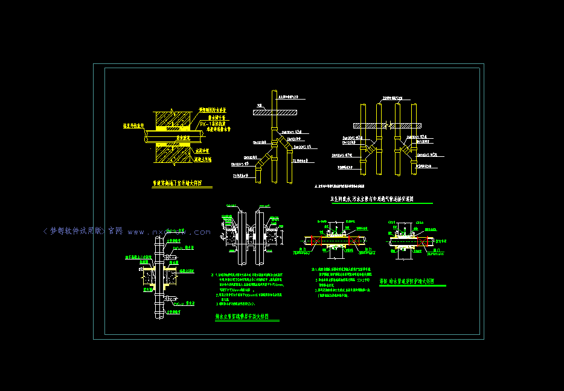
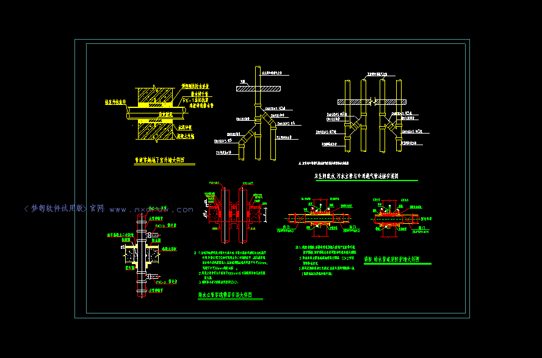

# 前端直接获取修改转换后的图纸各种数据

在mxcad中, 转换后的图纸(.mxweb格式的文件)可以通过mxcad npm包得到图纸的各种数据，如图层、文字样式、图块、以及图形对象中的数据等等。

我们经常需要拿到这些数据并对它们进行修改，然后在显示的图纸上应用这些修改后的数据。

mxcad提供了数据库，专门用于处理这些数据的增删改查。

当转换的图纸打开后, 就会存在这个打开图纸的数据库， 我们可以从数据库中得到想要并修改想要的数据

如何打开图纸请参考: https://mxcadx.gitee.io/mxcad_docs/zh/1.%E6%8C%87%E5%8D%97/1.%E5%BF%AB%E9%80%9F%E5%85%A5%E9%97%A8.html

## 数据如何获取和修改

以图层数据为例:

```ts
import { McCmColor, MxCpp, createMxCad } from "mxcad"
// 获取当前的控件
const mxcad = MxCpp.App.getCurrentMxCAD();
//  得到数据库中的图层表
const layerTable = mxcad.getDatabase().getLayerTable();
//  得到所有图层的ID对象
const aryId = layerTable.getAllRecordId();

const layers = aryId.map((id) => {
    // 得到对应ID的图层数据对象
    let layerRec = id.getMcDbLayerTableRecord();
    if (layerRec === null) return;
    return layerRec
})
// 设置第一个图层的颜色
const layer = layers[0]
if (!layer) return
const color = new McCmColor()
color.setRGB(255, 0, 0)
layer.color = color
// 更新显示就可以发现图纸0层上的所有选择了颜色随层的图形都变成了红色
mxcad.updateDisplay()
```

从上述代码中可以得出:

1. 图层数据对象由图层ID对象得到

2. ID对象可以访问到其对应的数据对象

3. 数据库存在各种表, 可以从表中得到存储的数据ID和数据对象

4. 数据对象可以访问属性和调用各种方法来设置或修改该数据

该代码实现效果:

改变图层颜色前:

改变图层颜色后:


其中 `getDatabase` 返回的是[McDbDatabase](https://mxcadx.gitee.io/mxcad_docs/api/classes/McDbDatabase.html)的实例, 可以查看到获取表的方法和对应的表实例说明, 其他表的数据修改和图层表类似，可根据文档自行实现数据增删改查。

在API文档中我们可以看到数据库中存在各种方法，其中有`getJson`和`setJson` 顾名思义就是JSON的序列化反序列化方法。

而实际上, 只要是继承了 [McRxObject]("https://mxcadx.gitee.io/mxcad_docs/api/classes/McRxObject.html")基类的都存在对应的序列化方法。

如图形类[McDbEntity](https://mxcadx.gitee.io/mxcad_docs/api/classes/McDbObject.html)的基类[McDbObject](https://mxcadx.gitee.io/mxcad_docs/api/classes/McDbObject.html)就继承了`McRxObject`基类, 所以每一个图形对象都是可以序列化的。

同样的每一个图形对象,  都可以通过对象ID[https://mxcadx.gitee.io/mxcad_docs/api/classes/McObjectId.html]来得到图形的数据对象， 修改这些数据对象上的属性，显示渲染的图形也会根据数据的变化而变化。

举个例子, 我们选中一个图形然后修改它的颜色, 代码如下:

```ts
import { MxCADUiPrEntity, MxCpp } from "mxcad"
// 得到当前控件
const mxcad = MxCpp.App.getCurrentMxCAD();
// 实例化一个mxcad提供的通过鼠标点击获得图形对象ID的类
let getEnt = new MxCADUiPrEntity();
const selectEntity = async ()=> {
    let id = await getEnt.go();
    // 通过ID对象得到图形数据对象
    let ent = id.getMcDbEntity();
    if(ent) {
        const color = ent.trueColor.clone()
        color.setRGB(255, 0, 0)
        ent.trueColor = color
        mxcad.updateDisplay()
    }
    selectEntity()
}
setTimeout(()=> {
    selectEntity()
}, 1000)
```

我们前面一直在说图形数据对象, 可以修改图形属性，那么什么才算是一个图形数据对象呢?

首先mxcad中的数据对象: 继承了[McDbObject](https://mxcadx.gitee.io/mxcad_docs/api/classes/McDbObject.html)的类实例，都是数据库的数据对象。

而图形数据对象就是继承了[McDbEntity](https://mxcadx.gitee.io/mxcad_docs/api/classes/McDbObject.html)的类实例

我们只需要操作这些数据对象，就可以修改这张图纸的所对应的信息。

例如[McDbLayerTableRecord](https://mxcadx.gitee.io/mxcad_docs/api/classes/McDbLayerTableRecord.html)一个图层数据对象, 和[McDbLayerTable](https://mxcadx.gitee.io/mxcad_docs/api/classes/McDbLayerTable.html)一个图层表数据对象, 图层表中存储图层数据，自然可以对表中整体数据进行增删改查，而可以争对某个图层数据对象的属性进行修改。

对图层的增删改查示例代码如下:

```ts
import { McCmColor, MxCpp, McDbLayerTableRecord, McDb } from "mxcad"
// 得到当前控件
const mxcad = MxCpp.App.getCurrentMxCAD();
// 实例化一个图层数据对象并设置这个图层的一些属性
const layer = new McDbLayerTableRecord()
layer.color = new McCmColor(0, 0, 0)
layer.isFrozen = true
layer.isLocked = true
layer.isOff = true
layer.lineWeight = McDb.LineWeight.kLnWt018
layer.name = "testLayer1"
// 拿到当前控件的数据库图层表
const layerTable = mxcad.getDatabase().getLayerTable();
// 将图层数据对象添加到图层表中会得到一个标识该图层数据的对象ID
const objId = layerTable.add(layer)
// 我们可以通过图层表的JSON序列化和反序列化来整体的增删改查一些图层
const layerJsonString = layerTable.getJson()
const layerJson = JSON.parse(layerJsonString)
// 这里我们只要保留以下几个名称的图层
const  keepLayerNames = ["0", "排水", "testLayer1"]
const keepLayers = layerJson.filter((layerJsonObj)=> {
    return keepLayerNames.includes(layerJsonObj.name)
})
const keepLayersJsonString = JSON.stringify(keepLayers)
layerTable.setJson(keepLayersJsonString)
// 最后我们可以通过has方法检查图层是否存在 get方法传入图层名来得到对应的对象ID
console.log("图层0是否存在", layerTable.has("0"))
console.log("图层0的对象ID", layerTable.get("0"))

```

[McDbLinetypeTable](https://mxcadx.gitee.io/mxcad_docs/api/classes/McDbLinetypeTable.html)线型表、[McDbTextStyleTable](https://mxcadx.gitee.io/mxcad_docs/api/classes/McDbTextStyleTable.html)文字样式表、[McDbBlockTableRecord](https://mxcadx.gitee.io/mxcad_docs/api/classes/McDbBlockTableRecord.html)图块表...等等，它们和图层表的使用方式大同小异，这里不一样举例, 可以直接点击对应名称详细了解。

附上本文演示Demo源码: https://gitee.com/mxcadx/mxdraw-article/blob/master/前端直接获取得到转换后的图纸各种数据/demo.zip