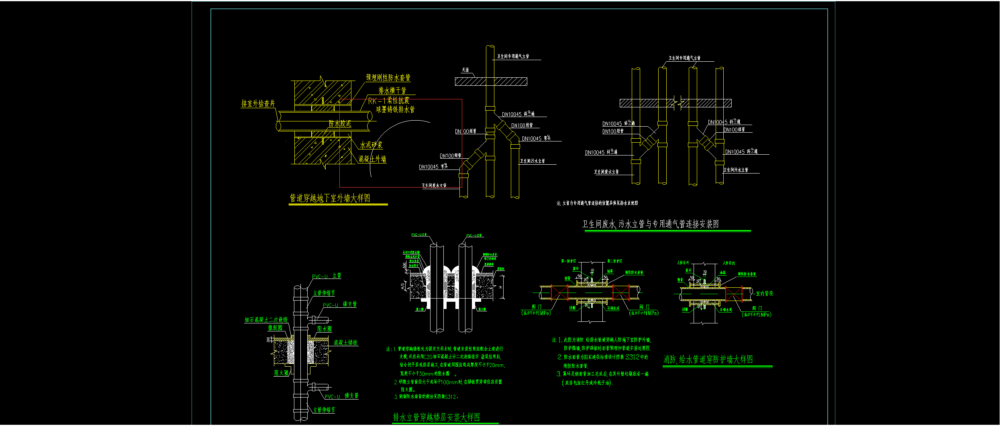
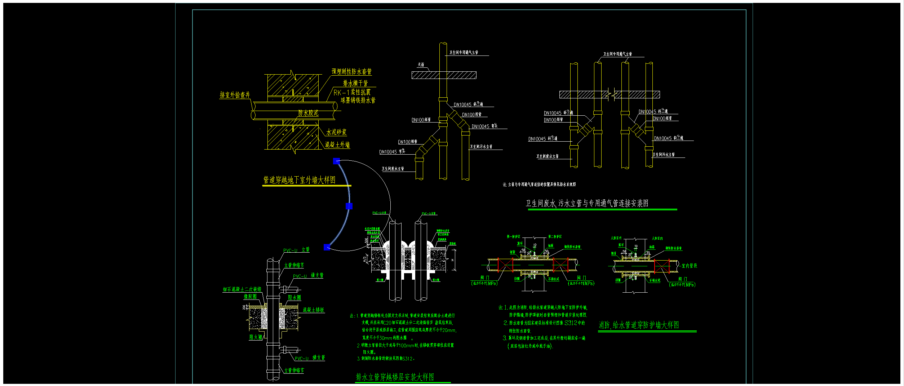

# 实现一种绘制圆弧的方式

首先我们要确定的是绘制圆弧的方式有很多种，

那么基于mxdraw库，这里我们通过继承Mx3PointArc类来实现两点绘制圆弧的功能。

类似于多样线画圆弧，只需要确定两个点就可以画一个圆弧的效果。

这两个点分别是圆弧的开始点和圆弧的结束点。

如果你对mxdraw不是很了解建议看看[官方文档mxdraw](https://mxcadx.gitee.io/mxdraw_docs/)。

## 介绍[Mx3PointArc](https://mxcadx.gitee.io/mxdraw_api_docs/classes/Mx3PointArc.html)

首先Mx3PointArc是通过给定的三个点来绘制圆弧的一个类。这三个点分别是起点（point1）、终点（point2）和第三个点（point3），其中第三个点是圆弧上的任意一点。

绘制圆弧的原理是通过计算得出圆的中心点（center）、半径（radius）以及起始角度（startAngle）和终止角度（endAngle）来确定圆弧的形状。

具体的步骤如下：

1.首先通过三个点计算出圆的中心点（center）。这可以通过计算两条垂直平分线的交点来实现。假设已知点A（point1）、点B（point2）和点C（point3），则可以计算出AB线段的中点和垂直于AB的斜率，再计算出BC线段的中点和垂直于BC的斜率，最后求出这两条垂直平分线的交点即为圆的中心点。

2.接下来，通过圆心和起点（point1）的距离来确定圆的半径（radius）。

3.然后，通过计算圆心到起点、圆心到终点和圆心到第三个点的角度，可以得到起始角度（startAngle）和终止角度（endAngle）。这可以通过三角函数来计算得出。

4.最后，根据圆弧的顺时针或逆时针方向进行调整。如果是顺时针方向，且起始角度小于终止角度，则将起始角度加上2π；如果是逆时针方向，且起始角度大于终止角度，则将终止角度加上2π。

通过以上步骤，可以使用给定的三个点来计算出圆弧中心点（center）、半径（radius）、起始角度（startAngle）和终止角度（endAngle），

从而通过THREE.EllipseCurve计算得出最终构成圆弧的(向量集合)points并通过mxdraw提供的自定义形状图形类[MxDbShape](https://mxcad.github.io/mxdraw_api_docs/classes/MxDbShape.html)渲染绘制出圆弧。

## Mx3PointArc基础继承

我们要实现两点画圆弧，就要自动去计算point3的位置。

我们先继承Mx3PointArc, 重写一些简单的代码。

```ts
import{ Mx3PointArc } from "mxdraw"
class MxDbArc extends Mx3PointArc {
  get startPoint() {
    return this.point1
  }
  set startPoint(v) {
    this.point1 = v
  }
  get endPoint() {
    return this.point2
  }
  set endPoint(v) {
    this.point2 = v
  }
  getTypeName(): string {
    return "MxDbArc"
  }
  getGripPoints(): THREE.Vector3[] {
    return [this.point1, this.point2, this.point3]
  }
}
```

上面的代码我们继承了Mx3PointArc 并重写了图形类的名称和显示的控制夹点数量.

并且我们新增了startPoint和endPoint 访问器，这样变量命名的意思更加明确。

## 计算point3(圆弧中点)

下面我们就需要计算this.point3这个控制点了， 在我们绘制完成后，这个控制点是一个弧线中点的位置。

所以我们在绘制时可以把this.point3当成弧线中点计算， 以下是具体代码:

```ts
import{ Mx3PointArc, McGiWorldDrawType,  McGiWorldDraw } from "mxdraw"
class MxDbArc extends Mx3PointArc {
  // ...
  worldDraw(pWorldDraw: McGiWorldDraw): void {
    // 这里比较特殊， 只有在动态拖动的绘制时去计算中点，才能达到我们想要的效果
    if(pWorldDraw.getType() === McGiWorldDrawType.kDynDragDraw) {
    //   计算中点 如果没有成功计算中点，我们也需要一个点来支撑下次的中点运算，
    //所以this.point3如果发现没有成功计算中点是需要一个默认值的
      this.point3 = this.getArcMidPoint()
      if(! this.point3 ) this.point3 = new THREE.Vector3(this.point1.x, this.point2.y)
    }
    super.worldDraw(pWorldDraw)
  }
  // 默认圆弧是不需要闭合的
  closed = false
  /** 获取圆弧线中点坐标 */
  getArcMidPoint() {
    const THREE = MxFun.getMxFunTHREE()
    let { startAngle, endAngle, center, radius, clockwise, autoClockwise } = this
    if(center.x ===0 && center.y ===0) return
    // 这里主要是更新计算必要的一些构成圆弧的参数 圆心、半径、角度、顺逆时针
    this.upDateCenter(this.point1, this.point2, this.point3)
    this.upDateRadius(this.point1)
    const [angle1, angle2, angle3] = this.compute3PointAngle()
    this.startAngle = THREE.MathUtils.degToRad(angle1)
    this.endAngle = THREE.MathUtils.degToRad(angle2)
    this.upDataClockwise(angle1, angle2, angle3)
    // 根据顺逆时针方向进行调整
    if (clockwise) {
      if (startAngle < endAngle) {
        startAngle += 2 * Math.PI;
      }
    } else {
      if (startAngle > endAngle) {
        endAngle += 2 * Math.PI;
      }
    }
    const midAngle = (startAngle + endAngle) / 2;
    const midX = center.x + radius * Math.cos(midAngle);
    const midY = center.y + radius * Math.sin(midAngle);
    return new THREE.Vector3(midX, midY, 0)
  }
}
```

## 实现绘制函数

现在我们实现以下绘制函数，其他就算得到圆弧开始点和结束点：

```ts
import{ MrxDbgUiPrPoint, MxFun } from "mxdraw"
const drawArc = async () => {
  const getPoint = new MrxDbgUiPrPoint()
  const arc = new MxDbArc()
  const p1 = await getPoint.go()
  if (!p1) return
  arc.startPoint = p1
  getPoint.setUserDraw((point, draw) => {
    arc.endPoint = point

    draw.drawCustomEntity(arc)
  })
  const p2 = await getPoint.go()
  if (!p2) return

  arc.endPoint = p2

  MxFun.getCurrentDraw().addMxEntity(arc)
}
```

最后我们在需要画圆弧的时候调用drawArc就可以通过指定开始点和结束点来确定一个圆弧了

效果图如下：
第一次绘制过程中的截图：


绘制完成点击圆弧中点拖动的截图:


当然还有其他方式可以实现两点绘制圆弧, 目前这种方式是比较简单实用的一些使用mxdraw的技巧。

我们可以通过mxdraw提供的各种图形类去继承或者组合去实现更多好用且实用的图形和绘制能力。


文档：[关于组合与继承mxdraw中的图形类](https://mxcadx.gitee.io/mxdraw_docs/graph/combination.html#%E5%A4%9A%E4%B8%AA%E5%9B%BE%E5%BD%A2%E7%BB%84%E5%90%88%E6%9E%84%E6%88%90%E4%B8%80%E4%B8%AA%E6%96%B0%E7%9A%84%E5%9B%BE%E5%BD%A2%E5%AF%B9%E8%B1%A1)

