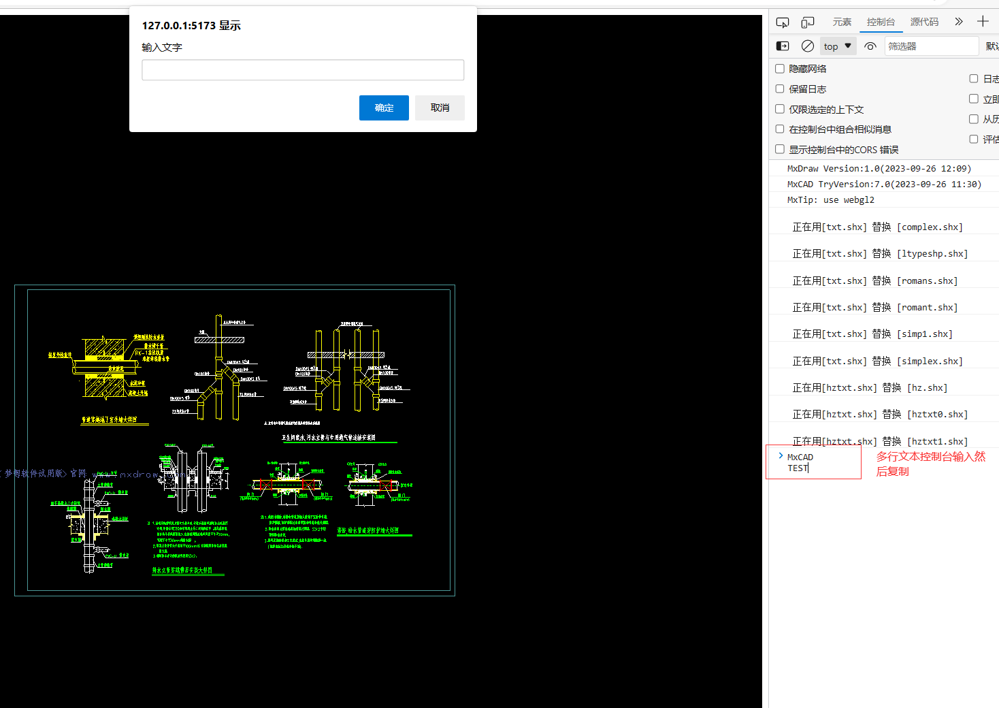
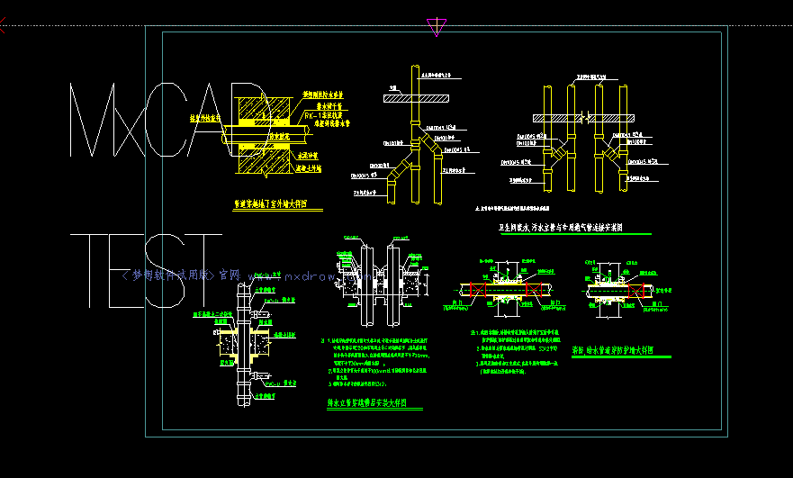
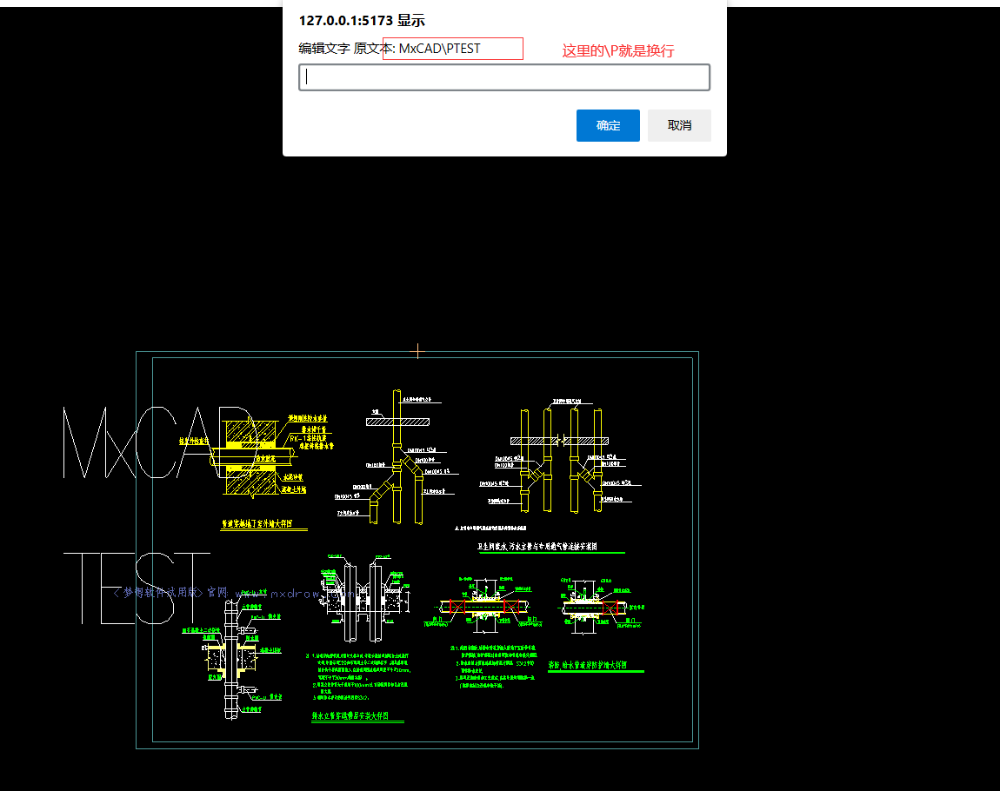
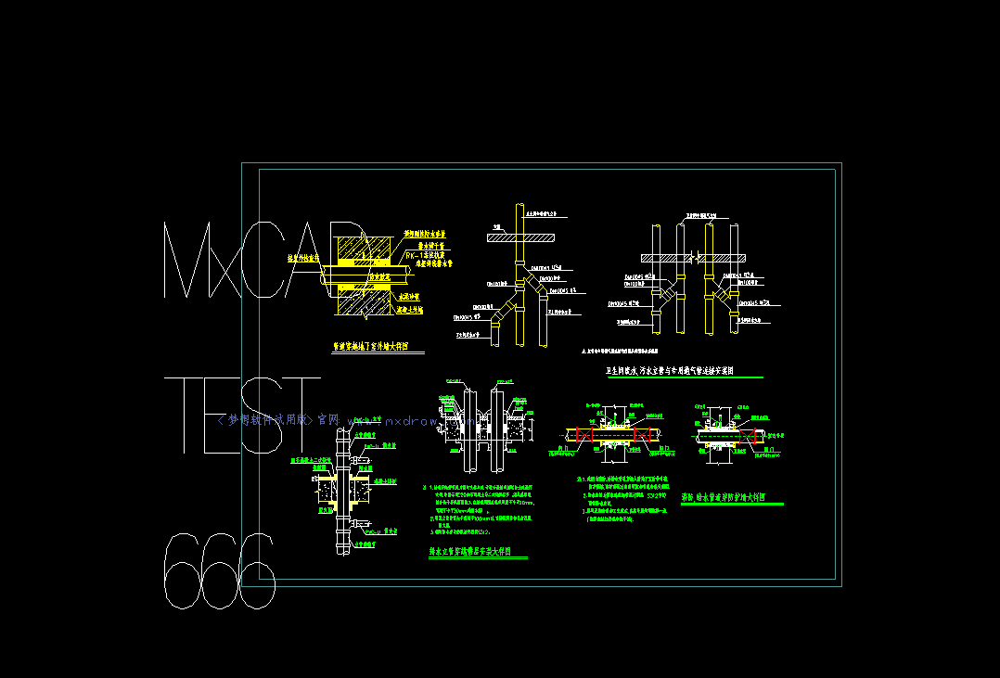

# 实现文字绘制


## 前言

在使用mxcad绘制文字之前请先按照[mxcad文档](https://mxcadx.gitee.io/mxcad_docs/zh/1.%E6%8C%87%E5%8D%97/1.%E5%BF%AB%E9%80%9F%E5%85%A5%E9%97%A8.html)

将cad图纸在网页上渲染出来, 如果没有阅读mxcad文档可能无法理解后续代码。

## 绘制文字和多行文字

单行文字代码如下:

```ts
import { McDbMText, McDbText, MxCADResbuf, MxCADSelectionSet, MxCADUiPrPoint, createMxCad } from "mxcad"

window.onload = async () => {
    const mode = "SharedArrayBuffer" in window ? "2d" : "2d-st"
    const mxcad = await createMxCad({
        canvas: "#myCanvas",
        locateFile: (fileName) => {
            return new URL(`/node_modules/mxcad/dist/wasm/${mode}/${fileName}`, import.meta.url).href
        },
        fileUrl: new URL("../public/test2.mxweb", import.meta.url).href,
        fontspath: new URL("../node_modules/mxcad/dist/fonts", import.meta.url).href,
    })

    const getPoint = new MxCADUiPrPoint()
    const point = await getPoint.go()
    if(point) {
        const text = prompt("输入文字")
        if (text) {
            const isNewLine = /\n/.test(text)
            if (isNewLine) {
                mxcad.drawMText(point.x, point.y, text.replace(/\n/g, "\\P"), 10000, 0, 0, 1)
            } else {
                mxcad.drawText(point.x, point.y, text, 10000, 0, 0, 1)
            }
        }
    } 
  
    alert("开始编辑文字")
    getPoint.clearLastInputPoint()
    const point1 = await getPoint.go()
    if(point1) {
        const filter = new MxCADResbuf()
        filter.AddMcDbEntityTypes("TEXT,MTEXT")
        const select = new MxCADSelectionSet()
        const objId = select.item(select.pointSelect(point1.x, point1.y, filter))
        const ent = objId.getMcDbEntity()
        let txt:string | undefined;
        if(ent instanceof McDbText){
            txt = (ent as McDbText).textString;
        }
        else if(ent instanceof McDbMText){
            txt = (ent as McDbMText).contents;
        }

        if(!txt) return;
        const text = prompt("编辑文字 原文本: " + txt)
        if(!text) return 
        if(ent instanceof McDbText){
            (ent as McDbText).textString = text;
          }
          else if(ent instanceof McDbMText){
            (ent as McDbMText).contents = text.replace(/\n/g, "\\P");
          }
    }
}
```

## 梳理一下绘制编辑文字思路

我们必须要创建一个mxcad的控制来显示图纸 其中变量[mxcad](https://mxcadx.gitee.io/mxcad_docs/api/classes/McObject.html)是通过[createMxCad](https://mxcadx.gitee.io/mxcad_docs/api/README.html#createmxcad)得到的实例控件, 

具体的参数配置和详细的注意事项请参考[mxcad入门文档](https://mxcadx.gitee.io/mxcad_docs/zh/1.%E6%8C%87%E5%8D%97/1.%E5%BF%AB%E9%80%9F%E5%85%A5%E9%97%A8.html)

要绘制文字 首先需要获取鼠标的点击, 得到一个CAD坐标, 有了坐标就知道这个文字绘制在什么位置了

这里使用mxcad提供的 [MxCADUiPrPoint](https://mxcadx.gitee.io/mxcad_docs/api/classes/MxCADUiPrPoint.html#class-mxcaduiprpoint)类用于获取鼠标点击, 得到对应的CAD坐标。

然后用浏览器提供的默认输入弹框`prompt`弹出了一个输入框，可以通过它来得到文字。

你也可以通过其他方式实现这样的一个功能。

有了文字，我们还是做一些处理，

[mxcad.drawText](https://mxcadx.gitee.io/mxcad_docs/api/classes/McObject.html#drawtext)就是绘制单行文字的方法

和[mxcad.drawMText](https://mxcadx.gitee.io/mxcad_docs/api/classes/McObject.html#drawmtext)就是绘制多行文的方法

其中多行文字换行的话，需要将`\n` 换成`\P`, 

所以 多行文字中出现\P 就会自动换行。

该规则后续可能存在变动，参考最新API说明为准(同时建议始终保持mxcad库是最新的)。

 而如果是单行文字存在换行`\n`会被显示成`63`, 你可能需要将换行符`\n`替换成`""`空字符串来解决这个问题。

以上是绘制文字的实现说明

发现不会的API函数可以前往[mxcad文档](https://mxcadx.gitee.io/mxcad_docs/api/README.html)搜索对应的关键词。

下面是关于编辑文字的实现说明

首先要在一张CAD图纸中编辑文字， 我们和绘制文字一样，需要鼠标点击这个文字得到它的坐标位置。

其中`getPoint.clearLastInputPoint`表示的是清空上一个输入点，因为那是绘制文字的输入点，我们现在并不需要。

然后我们需要筛选， 看看我们点击的是不是文字

我们可以通过mxcad提供的[MxCADResbuf](https://mxcadx.gitee.io/mxcad_docs/api/classes/MxCADResbuf.html#class-mxcadresbuf)类的实例方法[AddMcDbEntityTypes](https://mxcadx.gitee.io/mxcad_docs/api/classes/MxCADResbuf.html#addmcdbentitytypes) 来添加CAD中的类型标识

文字的类型标识就是`TEXT`和多行文字`MTEXT` 按照规则用`,`隔开。

然后我们就可以在CAD图纸中选择需要的文字了。

在mxcad中提供了[MxCADSelectionSet](https://mxcadx.gitee.io/mxcad_docs/api/classes/MxCADSelectionSet.html#class-mxcadselectionset)类来实现选择图形对象相关的功能。

我们这里选择用[MxCADSelectionSet.pointSelect](https://mxcadx.gitee.io/mxcad_docs/api/classes/MxCADSelectionSet.html#pointselect)CAD坐标点的方式选择我们的文字

加上我们的筛选条件`MxCADResbuf`的实例, 就可以得到一个索引。

我们通过[MxCADSelectionSet.item](https://mxcadx.gitee.io/mxcad_docs/api/classes/MxCADSelectionSet.html#item)得到具体的图形对象实例

我们可以通区分不同的构造类 来区分不同的图形对象实例

比如[McDbText](https://mxcadx.gitee.io/mxcad_docs/api/classes/McDbText.html#class-mcdbtext) 和[McDbMText](https://mxcadx.gitee.io/mxcad_docs/api/classes/McDbMText.html#class-mcdbmtext)类就是单行文字和多行文字的构造类

最后我们还是用`prompt`得到一个新的输入， 将新输入的文字内容赋值给文字对象就完成了文字的编辑。

效果图:





最后复制源文本然后补充了`\P666`


最后附上该文章的演示demo源码: https://gitee.com/mxcadx/mxdraw-article/blob/master/实现绘制文字/demo.zip