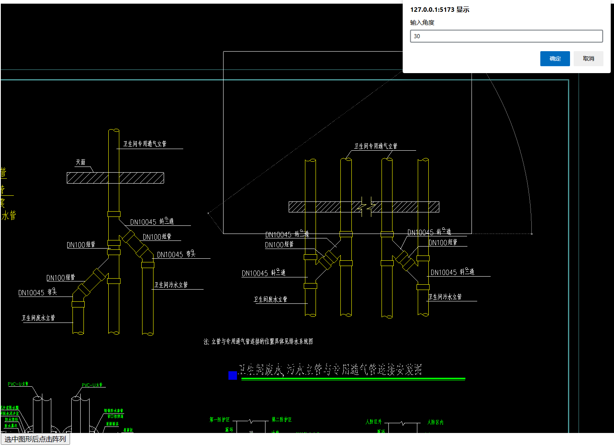
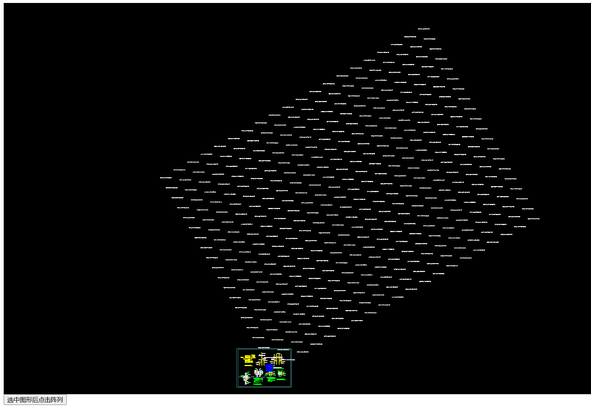
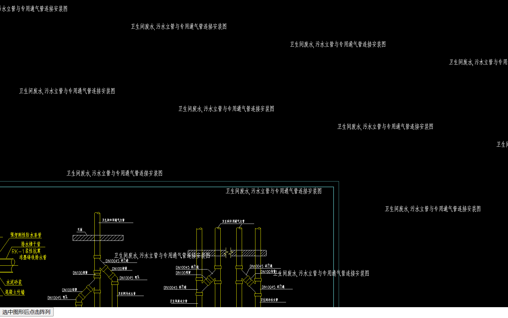

# 实现阵列功能

要在cad中实现阵列功能, 需要使用[mxcad](https://mxcadx.gitee.io/mxcad_docs/zh/1.%E6%8C%87%E5%8D%97/1.%E5%BF%AB%E9%80%9F%E5%85%A5%E9%97%A8.html)来完成这一需求

首先我们需要按照[mxcad入门文档](https://mxcadx.gitee.io/mxcad_docs/zh/1.%E6%8C%87%E5%8D%97/1.%E5%BF%AB%E9%80%9F%E5%85%A5%E9%97%A8.html)将一个测试的CAD图纸显示在页面中。

然后开始实现我们的阵列功能。

阵列功能是按一定规律对某个或多个图形组合进行复制偏移，生成出新的图形组合。

我们可以基于mxcad库实现这个功能.

在实现它之前我们要确保已经用mxcad库在页面中显示了一个cad图纸

然后我们用鼠标点击一个或者多个图形, 就可以选中它们了

选中后执行以下代码:

```ts
const rowNum = Number(prompt("输入行数"))
const colNum = Number(prompt("输入列数"))
if (isNaN(rowNum) || isNaN(colNum)) return

alert("点击画布两点之间的距离作为偏移量")
let offset = await MxCADUtility.getCorner("输入偏移距离");
if (!offset) return
let dColOffset = offset.pt2.x - offset.pt1.x;
let dRowOffset = offset.pt2.y - offset.pt1.y;

// 得到选中的图形
let aryId = await MxCADUtility.userSelect("选择陈列对象");
// 得到这些图形的包围盒
let ext = MxCADUtility.getMcDbEntitysBoundingBox(aryId);
if (!ext) return;

let cenPt = new McGePoint3d();

if (dColOffset > 0)
    cenPt.x = ext.minPt.x;
else
    cenPt.x = ext.maxPt.x;

if (dRowOffset > 0)
    cenPt.y = ext.minPt.y;
else
    cenPt.y = ext.maxPt.y;
// 角度
let dAng = Number(prompt("输入角度"));
if (isNaN(dAng)) return
let matRot = new McGeMatrix3d().setToRotation(dAng * Math.PI / 180.0, McGeVector3d.kZAxis, cenPt);

// 循环渲染
let iMaxNum = 50000;
let iCount = 0;
for (let i = 0; i < rowNum; i++) {
    // 行 平移矩阵
    let yOffsetVec = new McGeVector3d(0.0, dRowOffset * i, 0.0);
    let offsetMatY = new McGeMatrix3d().setToTranslation(yOffsetVec);

    for (let j = 0; j < colNum; j++) {
        if (i == 0 && j == 0)
            continue;
        // 列 平移矩阵
        let xOffsetVec = new McGeVector3d(dColOffset * j, 0.0, 0.0);
        let ofssetMatX = new McGeMatrix3d().setToTranslation(xOffsetVec);

        let vecOffset = new McGePoint3d(cenPt.x, cenPt.y, cenPt.z);
        // 应用对应矩阵
        vecOffset.transformBy(offsetMatY);
        vecOffset.transformBy(ofssetMatX);
        vecOffset.transformBy(matRot);

        // 最终的变换矩阵
        let tmpMat = new McGeMatrix3d().setToTranslation(new McGeVector3d(vecOffset.x - cenPt.x, vecOffset.y - cenPt.y, vecOffset.z - cenPt.z));
        for (let m = 0; m < aryId.length; m++) {
            let tmp = aryId[m].clone() as McDbEntity
            if (!tmp) {
                continue;
            }
            // 将该变换矩阵应用在图形对象上
            tmp.TransformBy(tmpMat);
            MxCpp.GetCurrentMxCAD().DrawEntity(tmp);
            iCount++;
            if (iCount > iMaxNum) {
                alert("超出最大阵列对象个数" + iMaxNum + "限制. \n");
                return;
            }
        }
    }
}
```

代码中主要让用户输入一些行列数和偏移距离以及角度值, 然后得到选中图形, 得到其包围盒,并计算出变换矩阵, 复制这些对象然后绘制在画布上

效果图:






以上效果图的源码下载: https://gitee.com/mxcadx/mxdraw-article/blob/master/实现阵列功能/demo.zip

访问https://demo.mxdraw3d.com:3000/mxcad/ 可以查看到更多已经实现好的cad相关功能

而对于需要自己二次开发cad相关功能, 可以参考:

mxcad入门: https://mxcadx.gitee.io/mxcad_docs/zh/

mxcad API文档 :https://mxcadx.gitee.io/mxcad_docs/api/README.html

