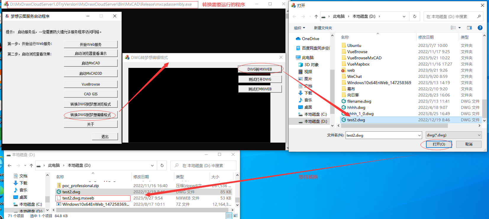
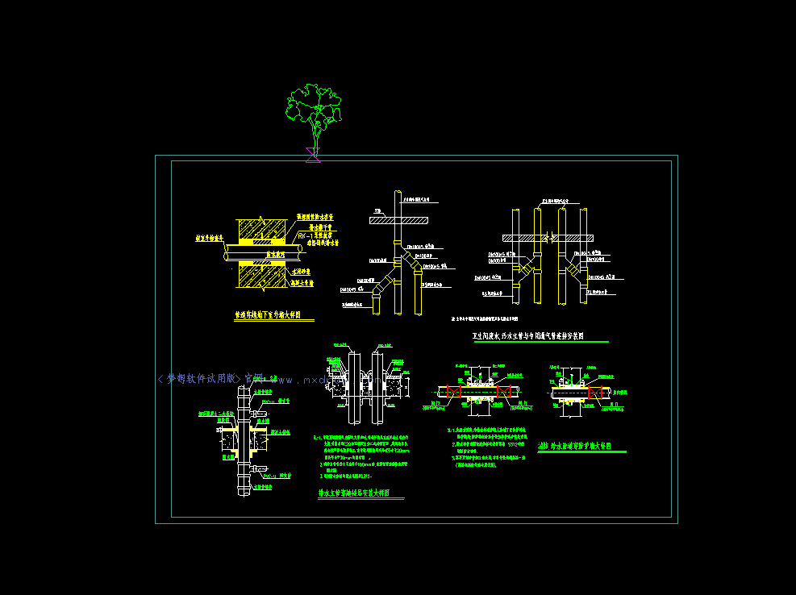

# 插入图块功能

在CAD中图块会被保存为dwg格式的文件。

在线CAD页面中实现插入图块功能，首先需要将这个图块dwg文件转换成mxweb文件。

我们需要下载[MxDraw云图开发包](https://www.mxdraw.com/download.html),根据[入门文档](https://help.mxdraw.com/?pid=32)的操作, 实现dwg文件到mxweb文件的转换, 让它支持在页面中显示。

下面简单讲解一下最简单的将dwg文件转成mxweb文件的方式:



更多关于图纸转换程序的使用说明可以参考[入门文档](https://help.mxdraw.com/?pid=32)或者[mxcad文档-图纸转换](https://mxcadx.gitee.io/mxcad_docs/zh/1.%E6%8C%87%E5%8D%97/2.%E5%9B%BE%E5%BD%A2%E8%BD%AC%E6%8D%A2.html)

有了mxweb文件,就可以通过[mxcad](https://mxcadx.gitee.io/mxcad_docs/zh/) npm包 在页面中实现插入图块功能。

无论是图纸还是图块 最终转换后都是mxweb文件。

在阅读了[mxcad文档-快速入门]("https://mxcadx.gitee.io/mxcad_docs/zh/1.%E6%8C%87%E5%8D%97/1.%E5%BF%AB%E9%80%9F%E5%85%A5%E9%97%A8.html")后, 你可以自己按照步骤去实现页面加载mxweb文件显示图纸

也可以直接下载或者参考我们提供的[示例源码](https://gitee.com/mxcadx/mxcad_docs/tree/master/examples)

下面我们直接实现如何插入图块功能,

我们就基于[示例源码](https://gitee.com/mxcadx/mxcad_docs/tree/master/examples)中vite目录这个由vite打包工具使用mxcad的初始化示例项目为例 来开始实现一个插入图纸的功能。

代码如下:

```ts
import { createMxCad } from "mxcad"
(async ()=> {
    const mxcad = await createMxCad({
        canvas: "#myCanvas",
        locateFile: (fileName) => {
            return new URL(`/node_modules/mxcad/dist/wasm/${mode}/${fileName}`, import.meta.url).href
        },
        fileUrl: new URL("../public/test2.mxweb", import.meta.url).href,
        fontspath: new URL("../node_modules/mxcad/dist/fonts", import.meta.url).href,
    })

    // 这里用定时器是保证稳定的测试, 正常来说是在需要的时候调用就好
    setTimeout(async () => {
        // 加载图块转换的mxweb文件
        let blkrecId = await mxcad.insertBlock(new URL("../public/tree.mxweb", import.meta.url).href, "tree");

        // id是否有效
        if (!blkrecId.isValid()) {
            return;
        }
        // 实例化一个块
        let blkRef = new McDbBlockReference();
        // 将加载的图块ID赋值给它
        blkRef.blockTableRecordId = blkrecId;
        // 然后计算一下这个块的包围盒
        let box = blkRef.getBoundingBox();
        if (box.ret) {
            let dLen = box.maxPt.distanceTo(box.minPt);
            // 如果图块包围盒特别小
            if (dLen > 0.00001) {
                // 则需要放大
                blkRef.setScale(mxcad.getMxDrawObject().screenCoordLong2Doc(100) / dLen);
            }
        }

        // 这里开始做用户交互
        let getPoint = new MxCADUiPrPoint();
        getPoint.setMessage("\指定插入基点");

        // 动态绘制这个图块
        getPoint.setUserDraw((v, worldDraw) => {
            blkRef.position = v;
            worldDraw.drawMcDbEntity(blkRef);
        });

        // 用户鼠标点击时得到位置
        let pt = await getPoint.go();
        if (!pt) return;
        blkRef.position = pt;
        // 绘制这个图块
        mxcad.drawEntity(blkRef);
    }, 1000)
})()

```

最终效果图:


本文上述代码源码下载: https://gitee.com/mxcadx/mxdraw-article/tree/master/插入图块功能/demo.zip