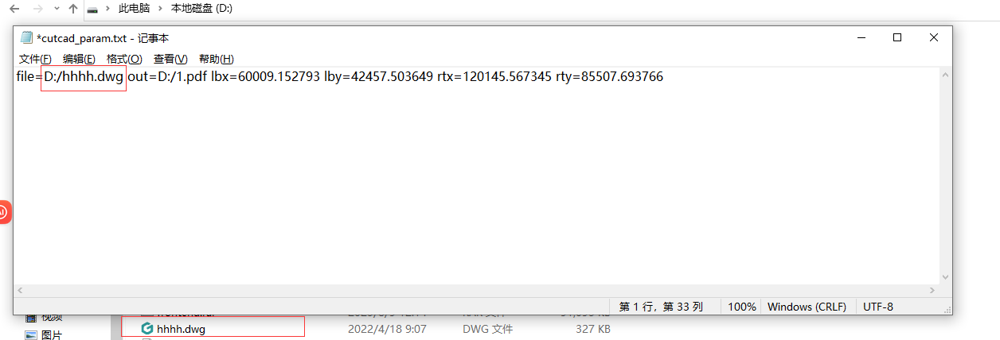
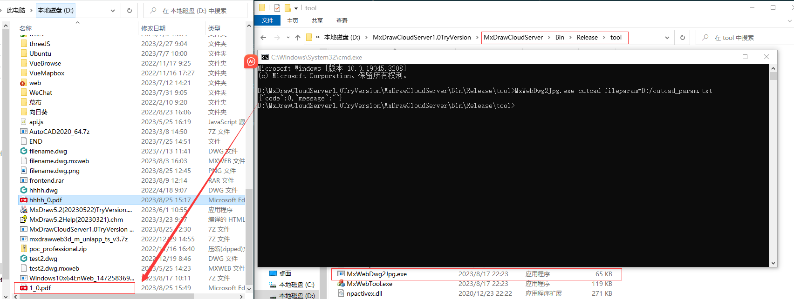
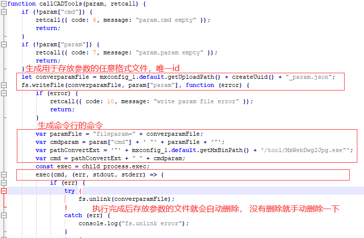
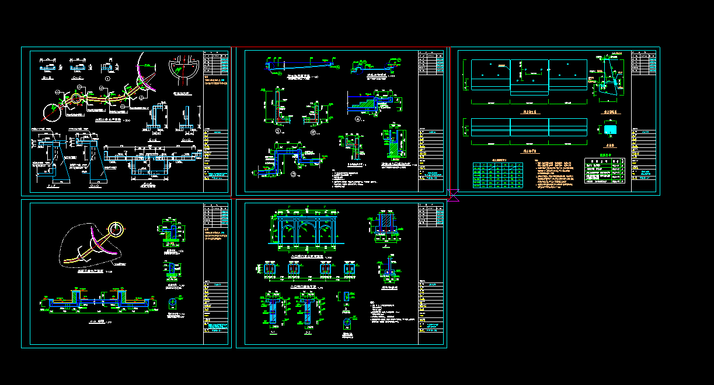
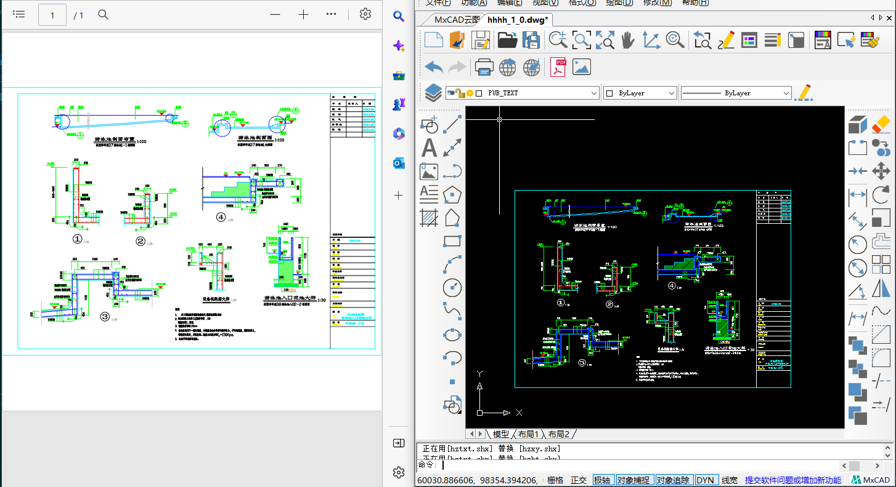

# 根据图框拆分图纸转成pdf打印

要将一张图纸一部分的内容框选出来打印成pdf 这个需求应该如何实现？

## 启动云图开发包Node服务

要将图纸框选的部分打印成pdf或者保存为dwg文件 就需要使用到云图开发包中提供的Node服务。

下载云图开发包: https://www.mxdraw.com/download.html

启动梦想云图Node.JS服务: https://help.mxdraw.com/?pid=115

## 前端选框选取

首先我们需要通过mxdraw库来显示预览图框，并且可以绘制一个选框来选择需要裁剪的内容。

然后通过梦想云图NodeJS服务中对应的API接口进行处理 得到一个裁剪后的图纸或者pdf文件。

前端代码如下:

```html
<div style="height: 80vh; overflow: hidden;">
    <canvas id="mxcad"></canvas>
</div>
```

```ts
import { MrxDbgUiPrPoint, MxFun, MxDbRect } from "mxdraw"
MxFun.setIniset({
  "EnableGripEidt": true,
})

MxFun.createMxObject({
  canvasId: "mxcad", // canvas元素的id
  // 转换后的cad图纸文件 实际访问的是../../demo/buf/$hhhh.dwg.mxb[index].wgh
  cadFile: "./buf/hhhh.dwg"
})
// 绘制临时的选框, 然后通过回调函数 根据框选的CAD坐标 请求云图Node服务对于API完成本地的转PDF功能
drawSelectBox((pt1, pt2) => {
  const params = new URLSearchParams();
  params.append('cmd', 'cutcad');
  // file 参数对应的是要拆分的目标图纸文件, 这里D:/hhhh.dwg是指的后台服务 部署的主机D盘下的hhhh.dwg文件; out参数同理
  params.append('param', `file=D:/hhhh.dwg out=D:/hhhh_1.pdf lbx=${pt1.x} lby=${pt1.y} rtx=${pt2.x} rty=${pt2.y}`);
  fetch('http://localhost:1337/users/tools', {
    method: 'POST',
    headers: {
      'Content-Type': 'application/x-www-form-urlencoded'
    },
    body: params.toString()
  }).then(async (res) => {
    const { code } = await res.json()
    if(code === 0) {
      alert("剪切成功")
    }else {
      alert("剪切失败")
    }
  }).catch((err) => {
    console.error(err)
  })
})
// 临时绘制一个选择框用于选择可以剪切的部分内容
async function drawSelectBox(callback: (pt1, pt2) => void) {
  const getPoint = new MrxDbgUiPrPoint()
  getPoint.go(() => {
    const pt1 = getPoint.value()
    // 需要将THREE.JS坐标转文档坐标.
    const cadPt1 = MxFun.docCoord2Cad(pt1.x, pt1.y, pt1.z)
    getPoint.setBasePt(pt1);
    const rect = new MxDbRect()
    rect.color = "#f00"
    rect.pt1 = pt1
    getPoint.setUserDraw((currentPoint, pWorldDraw) => {
      rect.pt2 = currentPoint
      pWorldDraw.drawCustomEntity(rect)
    })
    getPoint.go(async () => {
      const pt2 = getPoint.value()
      const cadPt2 = MxFun.docCoord2Cad(pt2.x, pt2.y, pt2.z)
      await callback(cadPt1, cadPt2)
    })
  })
}
```

## 调用MxWebDwg2Jpg.exe 程序剪切图纸

我们需要一张测试该功能的图纸, 该图纸在demo实例的demo/public/hhhh.dwg 中, 现在我们把它放在D盘下.
下面梳理一下对CAD图纸剪切，并将剪切结果输为 pdf dwg 文件的功能的使用:

我们提供的该功能程序是在云图开发包中的`MxDrawCloudServer\Bin\Release\tool\MxWebDwg2Jpg.exe`

要正确启动它需要对应的参数 首先需要一个cmd 这里我们的cmd就是 `cutcad`

其次还需要一些参数, 这些参数统一存放在一个txt文件中, 比如现在在D盘创建一个叫`cutcad_param.txt`的文件内容如下:

```txt
file=D:/hhhh.dwg out=D:/1.pdf lbx=60009.152793 lby=42457.503649 rtx=120145.567345 rty=85507.693766
```

这里out参数可与是.dwg的图纸文件, 那么就会剪切成图纸



现在我们直接进入到`MxDrawCloudServer\Bin\Release\tool`目录, 运行如下命令:

```sh
MxWebDwg2Jpg.exe cutcad fileparam=D:/cutcad_param.txt
```

`cutcad_param.txt`可以是任意格式的文件, 执行后如果命令行返回的结果中`code`是0, 则说明执行成功, 否则失败.

无论成功或者失败`cutcad_param.txt`都将被自动删除掉



## NodeJS后端实现拆分剪切pdf打印和dwg图纸

云图开发包中的NodeJs服务中对应的接口我们可以在`MxDrawCloudServer\Bin\MxDrawServer\Windows\routes`目录中查看对应源码

其他user.js文件中定义了`tools`接口 在上面前端代码中就算用这个接口进行的测试.

在tools接口中其实是调用了convert.js文件中的`callCADTools`函数



根据上图callCADTools函数的代码, 我们可以看到 其实就是生成存放参数的文件,

然后调用一下我们提供的MxWebDwg2Jpg.exe就可以了

剪切后的实际效果图

剪切红色选框中的内容:


剪切部分转换成pdf和dwg文件打开显示内容:


## 需要注意的事项

* 部分图纸裁剪可能无效, 有问题的图纸可以反馈给我们

* 前端mxdraw库实现裁剪需要将坐标转成CAD文档坐标, 然后后端通过转换前的原图纸进行裁剪

* 云图开发包Node服务中的API接口只是简单的测试一下功能是可以正常使用的, 具体使用的时候需要根据实际需求进行修改

* 剪切的内容可以通过out参数 来存放在一个pdf格式或者dwg格式的文件中

